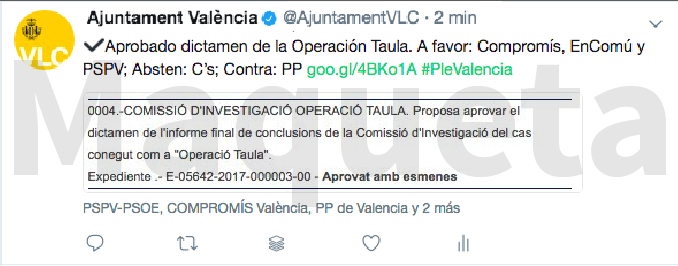
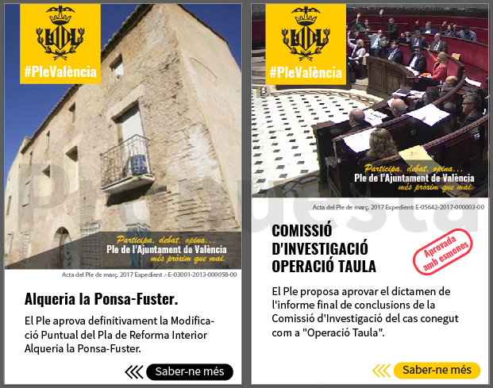

 UNIVERSITAT POLITÈCNICA DE VALÈNCIA

 ESCOLA POLITÈCNICA SUPERIOR DE GANDIA 

            

# “Diseño de una experiencia transmedia para Plenos Municipales”

 TRABAJO FINAL DE GRADO 

         

 Autor/a:
Josep Escrivà Savall 


 Tutor/a:
David Pardo Gimilio  
Diego Álvarez Sánchez

 
 GANDIA, 2017. 

         
**RESUMEN**

En la actualidad, el desarrollo de un nuevo paradigma de gobernanza basado en el Gobierno Abierto unido a la repolitización del espacio público surgida a partir del movimiento 15M, está favoreciendo la introducción de mayores cotas de participación de la ciudadanía en los procesos de toma de decisiones.
Este trabajo asume el desarrollo de una experiencia transmedia para los Plenos Municipales tomando como objeto el Pleno del Ayuntamiento de València. Esta memoria contiene un resumen del objeto de estudio, los Plenos Municipales y el estado del arte del concepto transmedia y sus cualidades, fruto de una exhaustiva revisión bibliográfica sobre narrativas transmedia, estudios y análisis sobre Comunicación Institucional y Política, estudios sobre el funcionamiento de los Plenos Municipales, como también sobre el comportamiento de los usuarios y sobre audiencias.
Para terminar, se propone una estrategia en forma de Paper Format a modo de Biblia Transmedia que siente las bases para implementar una estrategia que atraiga a la ciudadanía a los debates sociales del Pleno Municipal, y que los usuarios, la perciban como una experiencia participativa.

**PALABRAS CLAVE**

Gobierno abierto, transparencia, participación ciudadana, programa
televisión, narrativa transmedia

**ABSTRACT**

Nowadays, the development of new political parties, which is based on an
open government, together with the repolitization of public spaces of
15M is encouraging the introduction of a bigger participation of
citizens who take part in the decision-making process.

This study assumes a transmedia experience design for municipal plenary
sessions, taking as object the València’s city Council Plenary. To
complete this research, the essay includes bibliographic reviews about
Transmedia Storytelling, examination and analysis about Political and
Institutional Communication, study about standards of practice of the
Plenary sessions, as well as studies about user behaviour and audience
studies.

To conclude, a Paper Format is proposed as Transmedia Bible that lays
the groundwork for implementing a strategic method that creates an
engagement between the citizens and the Plenary social conversation. So
that, they would realise it as a participative experience.

**KEYWORDS**

Open government, transparency, citizen participation. TV program,
transmedia narrative.

      
**ÍNDICE**

|   |   |   |
|------|-------|--------|
|1.|INTRODUCCIÓN|3|
|1.1.|PRESENTACIÓN|3|
|1.2.|OBJETIVOS|4|
|1.3.| METODOLOGÍA	|4|
|1.4.|ESTRUCTURA DE LA MEMORIA|6|
|2.|ESTADO DEL ARTE|7|
|2.1.|PLENOS MUNICIPALES|7|
|2.1.1.|ATRIBUCIONES DEL PLENO MUNICIPAL|7|
|2.1.2.|FUNCIONAMIENTO DEL PLENO MUNICIPAL|7|
|2.1.3.|SISTEMAS DE RETRANSMISIÓN EN PLENOS MUNICIPALES|8|
|2.2.|CUALIDADES TRANSMEDIA|9|
|2.2.1.	|MEDIO	|9|
|2.2.2.|NARRATIVAS TRANSMEDIA|11|
|2.2.3.|PÚBLICO OBJETIVO|12|
||HERRAMIENTAS|14|
||Estudio de medios|14|
||Encuestas|16|
||Escucha activa|17|
|2.2.4.|CONTENIDOS|18|
||CANALES|20|
||YouTube|20|
||Twitter|20|
||Facebook|21|
||Wordpress|23|
||Whatsapp|23|
|2.2.6.|ANÁLISIS DE CASOS|24|
|2.2.7.|CARACTERÍSTICAS DE LA PRODUCCIÓN|25|
|3.|DISEÑO DE LA EXPERIENCIA TRANSMEDIA|27|
|3.1|FICHA TÉCNICA|27|
|3.2	|TRATAMIENTO ARGUMENTAL|27|
|3.3	|ESPECIFICACIONES FUNCIONALES|31|
|3.4|ESPECIFICACIONES DE DISEÑO|37|
|3.5|ESPECIFICACIONES TECNOLÓGICAS|39|
|3.6|OBJETIVOS TRANSMEDIA|40|
|4.|CONCLUSIONES|43|
|5.|BIBLIOGRAFÍA	|45|

     
**ÍNDICE FIGURAS Y TABLAS**

|  |  |  |
| ---------- | ---------- | ----------- |
| **Figura 1:**  | Ratio de prosumidores frente a consumidores pasivos. Fuente Acuña y Caloguerea, (2012).  | Pag:14 |
| **Figura 2:**  | Perfil de internautas por edades e índice socioeconómico. Fuente EGM 2017.  | Pag:15  |
|**Figura 3:**|Uso de las redes sociales. Fuente IAB 2017.|Pag:15|
|**Figura 4:**|Composición de la audiencia por dispositivos por países. Fuente Martín (2017). |Pag:16|
|**Figura 5:** |Interés por los debates políticos en internet. Kantar Media (2016).|Pag:16|
|**Figura 6:**|Niveles de compromiso y su relación con el contenido y los usuarios. Fuente Acuña y Caloguerea (2012).|Pag:18|
|**Figura 7:**|Pirámide extendida. Modelo de João Canavilhas. Elaboración propia. |Pag:18|
|**Figura 8:**|Estructura hipertextual de la pirámide de João Canavilhas. Elaboración propia.|Pag:19|
|**Figura 9:** |Propuesta modelo de tuit. Elaboración propia.|Pag:21|
|**Figura 10:**|Propuesta de dos publicaciones tipo *Stories*. Elaboración propia. |Pag:23|
|**Figura 11:**|Diagrama del viaje del usuario. Elaboración propia.|Pag:35|
|**Figura 12:**|Cronograma de un ciclo de la experiencia. Elaboración propia.|Pag:36|
|**Figura 13:** |Collage de estilos corporativos próximos a la ciudadanía. Elaboración propia.|Pag:37|
|**Figura 14:** |Maqueta diseño perfil de Facebook. Elaboración propia.|Pag:38|
|**Figura 15:**|Maqueta diseño canal de YouTube. Elaboración propia.|Pag:39|

       

|    |    |    |
|---------|---------|-------|-------|
|**Tabla 1:** |Visión general de los canales agrupado por características de propiedad y control.|Pag:34|

    

**ÍNDICE ANEXOS**

|   |   |   |
|---------|---------|-------|-------|
|**Anexo 1:**|18 técnicas transmedia para el pleno municipal.|Pag:2|
|**Anexo 2:**|Controladoras de realización.|Pag:4|
|**Anexo 3:**|Lenguaje respetuoso.|Pag:6|
|**Anexo 4:**|Referentes gráficos.|Pag:8|

       

INTRODUCCIÓN
===========

PRESENTACIÓN
------------

Nos encontramos en un escenario donde la desafección ciudadana por los
asuntos públicos, distancia a la ciudadanía de la política y de las
instituciones valorándolas de forma negativa. En este contexto, los
estudios sociológicos sitúan los fraudes y corrupción como la segunda
preocupación de los españoles justo después del problema del desempleo
(CIS, 2017). Por otro lado, lo que se está haciendo llamar “la crisis de
la democracia” representa el distanciamiento de la ciudadanía, pero no
necesariamente significa la deslegitimación de este sistema de gobierno
(Castells, 2009).

Paralelamente, los medios de comunicación de masas se encuentran
envueltos en una crisis de credibilidad (Calvo, Martinez y Juanatey,
2014).

Todas estas situaciones, se agravan con lo que se está haciendo llamar
“la era de la posverdad”, que difumina las fronteras entre la verdad y
la mentira, honestidad y deshonestidad, apelando continuamente a los
sentimientos y emociones de los públicos y ciudadanía (Marzal y Casero,
2017).

No obstante, cabe señalar que las instituciones y gobiernos están
esforzándose para fomentar la publicidad activa de los organismos de
decisión y hacer más visibles las tareas que desempeñan las
administraciones y políticos. Aun así, la ciudadanía sigue con este
sentimiento de incredulidad y desafección por los asuntos públicos.

Dicho de otro modo, por una parte, encontramos una ciudadanía
desafectada y vigilante, que demanda estar más implicada en los asuntos
públicos. Por otra parte, una legislación aperturista que, entre otras
cosas promueve el acceso íntegro a la información institucional.

Para finalizar, a pesar de las constantes demandas en materia de
transparencia y buen gobierno por parte de los colectivos ciudadanos
organizados y las acciones gubernamentales. La participación y el uso de
los portales de transparencia no está teniendo el éxito esperado. Por lo
que acercar un evento tan relevante y público como es el Pleno de un
municipio a su ciudadanía, puede contribuir a mejorar el acceso a la
información y aumentar la confianza en las políticas y los asuntos
públicos. Sin duda a aumentar el interés por los asuntos públicos más
cercanos.

Este trabajo pretende contribuir a este acercamiento mediante el
análisis y el desarrollo de una experiencia transmedia que pueda acortar
distancias y establecer vínculos informativos entre la Administración
Pública y la ciudadanía. La intención última de este trabajo, es la de
combatir la desafección política e institucional mediante el empleo de
técnicas y lenguajes propios de la comunicación audiovisual y transmedia
en particular, cuya importancia es cada vez mayor en los formatos
audiovisuales[^1] (EUROPA PRESS, 2015).

De este modo, quien realiza este proyecto, tiene voluntad de investigar
y proponer alternativas que puedan ser adoptadas por los gabinetes de
prensa de ayuntamientos con el fin de acercar los plenos a la
ciudadanía, de forma que las opciones de acceso a la información rebasen
los mínimos exigidos por las normativas sobre publicidad activa de la
información pública.

En definitiva, y como se detallará en los siguientes puntos de este
capítulo, lo que este trabajo pretende es: primero, analizar los plenos
municipales y las formas de retransmisión actuales; segundo, estudiar
sobre narrativas transmedia y sus elementos; por último, proponer una
experiencia transmedia que acerque a la ciudadanía al debate social del
Pleno.

OBJETIVOS
---------

El objetivo principal es el desarrollo de un formato transmedia para la
retransmisión de los plenos municipales de forma atractiva para la
ciudadanía. Con pretensión de fomentar el interés en el pleno municipal,
y que a su vez, su implantación sea un aliciente para el consumo del
programa, contemplando como partes del todo los siguientes objetivos
secundarios:

-   Analizar las características funcionales del Pleno Municipal y sus
    medios de difusión y publicidad audiovisual que permitan adquirir un
    conocimiento de su estructura y funcionamiento para su posterior
    conversión al lenguaje audiovisual.

-   Revisar bibliografía sobe comunicación política e institucional para
    conocer las peculiaridades de esta especialidad comunicativa.

-   Realizar una revisión bibliográfica sobre narrativas transmedia y
    sus bases teóricas de los principales autores en este nuevo campo
    que asienten las bases de dichas técnicas y que permitan deducir y
    concluir nuevos razonamientos que podrán ser aplicados en el
    desarrollo de proyectos transmedia.

-   Revisar estudios sobre comportamiento de los usuarios y la
    investigación de las audiencias de internet afín de aprender a
    definir un *target* realista para el proyecto.

-   Crear un *paper format* a modo de Biblia Transmedia donde plasmar y
    difundir el formato el formato fruto del conocimiento adquirido a
    través del desarrollo de los anteriores objetivos.

METODOLOGÍA
-----------

Este trabajo se ha desarrollado en el marco de colaboración en una beca
de I+D+i en la Càtedra Govern Obert de la Universidad Politécnica de
València y el Ayuntamiento de València.

A partir de esta circunstancia, se ha empleado como metodología inicial
y sin duda fundamental, la revisión bibliográfica. Así mismo, se ha
necesitado la consulta de documentación normativa, y de artículos, como
también de webs y de blogs especializados. De igual modo, también he
desarrollado un breve análisis de la comunicación del Pleno del
Ayuntamiento de Madrid y se ha comparado con la comunicación del Pleno
del Ayuntamiento de València.

Cabe destacar, que en mi colaboración como becario de la Càtedra GO[^2],
he tenido oportunidad de profundizar en los aspectos que seguidamente se
detallan:

Por un lado, sobre la comunicación de los Plenos Municipales, he tenido
la posibilidad de entrevistarme con el Sr. José Ignacio Pastor, jefe del
Servicio de Transparencia y Gobierno Abierto. Además de poder adquirir
conocimientos de primera mano del funcionamiento interno de los Plenos
de València y de su difusión, he podido asistir de forma presencial a
uno de ellos.

Así mismo, también he asistido a varios Plenos del Ayuntamiento de
Oliva, como también he visualizado retransmisiones plenarias de
diferentes localidades para conocer las funcionalidades que implementan
en las plataformas de difusión. En cuanto a comunicación institucional,
queda agregar la asistencia a conferencias y talleres dentro del ámbito
de la transparencia y publicidad institucional.

Por otro lado, en lo que al transmedia se refiere, (y también dentro del
marco de la Càtedra Govern Obert), me he encargado de la organización de
un taller sobre guion transmedia para la no ficción, que impartió el
profesor experto en transmedia Esteban Galán[^3], en el cual,
colaboraron asociaciones del ámbito de la comunicación, periodismo y
periodismo ciudadano. En este encuentro, se desarrollaron interesantes
conceptos en torno a las narrativas transmedia, de donde surgieron
dieciocho técnicas transmedia de aplicación para los Plenos Municipales
(ver anexo 1).

Siguiendo con el aprendizaje sobre transmedia, se debe agregar mi
asistencia al Congreso de Comunicación Local[^4] que se celebra cada año
en la Universitat Jaume I, cuya temática, en esta edición, se centraba
en la televisión de proximidad transmedia. En este congreso, tuve
ocasión de conocer diferentes planteamientos de proyectos transmedia
desde una perspectiva profesional por parte de sus autores, además de la
visión academicista que presentaron el Profesor de periodismo Ramón
Salaverría[^5] y el Catedrático en comunicación José Manuel Pérez. De
igual modo, también he participado en el taller de creación de mundos
transmedia impartido por el profesor Carlos Alberto Scolari[^6] en los
cursos de la Universidad de Verano celebrados en la Escuela Politécnica
Superior de Gandia, donde en los descansos tuve la oportunidad de
comentar el proyecto con el profesor, uno de los máximos exponentes
académicos en Narrativas Transmedia de habla hispana.

La finalidad de todo esto es, por un lado, profundizar y comprender las
dinámicas del Pleno Municipal; y por otro, intentar reconocer diferentes
puntos de vista en torno al diseño de experiencias transmedia para
después aplicarlo en mi propuesta de diseño de una experiencia
transmedia para Plenos Municipales usando como caso práctico y concreto,
el Pleno del Ayuntamiento de València.

ESTRUCTURA DE LA MEMORIA
------------------------

El capítulo primero, comienza con una introducción al TFG donde a través
de la contextualización se infieren cuáles han sido mis motivaciones y
el porqué de la necesidad de desarrollar este proyecto. Seguidamente,
expone el objetivo principal y qué otros objetivos secundarios se
quieren alcanzar, así como la metodología empleada para ello. Para
finalizar este capítulo, este punto detalla cómo se estructura el
proyecto.

El capítulo segundo, desarrolla el estado del arte en dos grandes
apartados.

El primer apartado contiene todo lo referente a los Plenos Municipales,
donde se especifican las competencias del Pleno Municipal, las normas de
intervención, los actores políticos que lo forman y al final del
apartado, un breve análisis de tres casos de publicidad audiovisual de
los plenos.

En el segundo apartado se encuentra lo que concierne al transmedia y se
estructura de la siguiente forma:

Primero, se define el concepto de medio, segundo se ensaya y se
especifica que se entenderá por *transmedia* en este trabajo, tercero se
fundamenta una investigación de audiencias y se razona sobre el
comportamiento de los usuarios. En cuarto lugar, se indica todo lo
referente a la generación de contenidos. En quinto lugar, se especifican
los medios propuestos para comenzar con la experiencia transmedia de los
plenos, se sigue con un análisis comparado entre la comunicación del
Pleno de Madrid y la del Pleno de València. Para finalizar este
capítulo, se ensaya sobre las características de la producción, donde se
especifican ciertas recomendaciones sobre el equipo de producción para
generar contenido de forma responsable.

En el tercer capítulo se diseña la experiencia transmedia usando como
guía los modelos propuestos en (Prádanos, 2012) y en (Acuña y
Caloguerea, 2012), como también todo lo aprendido a lo largo de estos
últimos meses de intenso estudio y trabajo.

El cuarto capítulo aborda por una parte las conclusiones tras la
realización del proyecto y por otra, trabajos futuros que podrían
desarrollarse tomando este trabajo como base.

En el último capítulo se detalla la bibliografía empleada en el
desarrollo de la memoria de este proyecto de fin de grado.
       

# 1.  ESTADO DEL ARTE

##     1.  PLENOS MUNICIPALES

###         1. ATRIBUCIONES DEL PLENO MUNICIPAL

Entre los diferentes órganos necesarios para la adopción de decisiones
por parte de los ayuntamientos, los Plenos constituyen el espacio de
deliberación y exposición pública donde la ciudadanía puede intervenir a
través de sus representantes políticos. Sin embargo, la adopción de
decisiones en los diferentes ámbitos competenciales de los plenos está
reservada en exclusiva a los concejales y concejalas mediante votación
ordinaria o nominal.

Por otro lado, en el proceso de toma de decisiones el papel de la
ciudadanía queda relegado a presentar alegaciones, reclamaciones o
sugerencias únicamente en aquellos casos en los que la decisión a
adoptar implique la aprobación de una ordenanza local. En el resto de
casos, las decisiones acordadas por los y las ediles son consideradas
decisiones finales.

Además, la documentación íntegra de los asuntos incluidos en el orden
del día de los plenos que sirve de base al debate y, en su caso,
votación, es accesible exclusivamente por los concejales o concejalas.

En lo que refiere a las actas, su publicidad está sujeta a las
normativas que regulan la publicación en el tablón de anuncios del
ayuntamiento. De igual modo, también estarán disponibles en la página
web.

### FUNCIONAMIENTO DEL PLENO MUNICIPAL

El pleno está presidido por el alcalde o alcaldesa de la corporación
municipal y le corresponden las funciones de convocatoria, ordenar los
debates y las votaciones, así como velar por el orden y el respeto a las
normativas reguladoras de los plenos.

En cuanto a las convocatorias, el pleno se puede celebrar mediante tres
tipologías de sesiones:

-   De forma habitual, se conforma por sesiones que se engloban en las
    ordinarias que tienen una periodicidad mensual -excepto en agosto,
    que no se celebran.

-   De forma excepcional, se podrá asignar una periodicidad inferior
    durante un tiempo determinado regulado por normativa.

-   Por otra parte, a menudo, para tratar temas específicos se convocan
    sesiones extraordinarias.

-   Por último, y con carácter muy especial se requieren sesiones
    extraordinarias de carácter urgente cuando hay razones que
    justifican la premura de los temas a tratar.

Respecto al lugar de celebración, por normativa, los plenos se celebran
en la casa consistorial del municipio (excepto por motivos de fuerza
mayor, habilitando un local para llevarlos a término).

En cuanto a la secuenciación y orden del pleno, el orden del día marca
los temas a tratar en la sesión plenaria, donde siempre se incluye en
los primeros puntos la aprobación de actas anteriores. En este caso, si
ningún concejal o concejala formúla alguna objeción, quedará
automáticamente aprobada.

Así mismo, como constante, el último punto es el de “Ruegos y
Preguntas”, donde los concejales y concejalas de la oposición, (u
organizaciones cívicas ajenas al gobierno), a través de algún grupo
político pueden hacer preguntas al gobierno, con un tiempo máximo de
tres minutos. El o la responsable de la delegación encargada del objeto
de la pregunta, deberá responder de forma oral o por escrito en el
momento, o si es necesaria la consulta técnica en el próximo pleno. Así
que, creo conveniente poner de relieve que esta es una de las partes más
imprevisibles y difíciles de controlar temporalmente.

Respecto al debate, es importante señalar que cada asunto se inicia con
la lectura completa del punto del orden del día. El debate de cada punto
empieza con una exposición y justificación de la propuesta por parte del
autor de la misma. Esta primera enunciación no consume turno de palabra.

Seguidamente se procede a la primera ronda de intervenciones con orden
de menor a mayor representación en el Pleno, siendo el autor de la
propuesta quien termine esta ronda ratificando o modificando lo expuesto
en la justificación, sin que ninguna de las intervenciones anteriores
pueda exceder de los cinco minutos.

Del mismo modo, en el turno de réplicas se utiliza una dinámica similar
a la de la primera ronda con la excepción de que el límite de tiempo se
reduce a tres minutos. Por otra parte, las intervenciones de la Alcaldía
proceden al final del cierre de las rondas, dejando una breve
intervención final al ponente de la propuesta.

En cambio, si por apreciación subjetiva se considera una alusión a algún
miembro o grupo de la corporación, se le otorgará una intervención por
alusiones al concejal o concejala que lo requiera. En el caso de hacer
alusión al grupo entero, será el portavoz quien intervenga.

Por otro lado, en asuntos de especial relevancia, la junta de portavoces
puede alterar los tiempos mediante previo comunicado al inicio de la
sesión.

Con esto, cabe especificar que el Pleno no tienen ninguna duración
concreta ni estipulada, sobre todo depende de la cantidad de puntos a
tratar, las características de estos y de las intervenciones que hagan
los representantes políticos. Mientras que hay plenos que son meros
trámites burocráticos y terminan de forma muy breve, hay otros que
tienen un gran interés político y pueden alcanzan jornadas enteras.

### SISTEMAS DE RETRANSMISIÓN EN PLENOS MUNICIPALES

Por lo que se refiere a los sistemas de retransmisión, en la Comunidad
Valenciana hay una ley que promueve la grabación y difusión de las
reuniones plenarias (GVA, 2015). En consecuencia, algunas corporaciones
locales están facilitando el acceso de la ciudadanía mediante
retransmisión vía *streaming* o accediendo a través de un archivo
audiovisual público. Además, hay ayuntamientos que están publicando las
grabaciones editadas en forma de video-acta interactiva permitiendo la
selección de cualquier punto incluido en el orden del día. Sin embargo,
a pesar de estas mejoras, el producto audiovisual resultante, a mi modo
de ver, sigue constreñido a un formato rígido carente de ritmo, lo cual,
no atrae al potencial espectador.

En varios ayuntamientos, como por ejemplo el de Oliva[^7], están
utilizando los servicios de *streaming* ofrecidos por la plataforma
YouTube. Los ayuntamientos pequeños suelen tener un sistema básico que,
mediante cámaras de vigilancia y sistemas de megafonía propios del
Pleno, retransmiten de forma instantánea y gratuita a través de YouTube.
Esta plataforma permite interactuar en chat, añadir comentarios y un
sistema de valoraciones. También permite compartir la retransmisión
aprovechando otros medios sociales para su difusión. Al terminar la
retransmisión en directo, el portal renderiza y almacena el vídeo para
su posterior visualización.

Por otro lado, hay otros ayuntamientos que hacen uso servicios
especializados en retransmisión de juntas administrativas y conferencias
como el que facilita la empresa Regmeet[^8] al Ayuntamiento de Xeraco.
También está el servicio de *Acta Digital*[^9], que es un producto
ofrecido por la empresa Axertia. Estos servicios consisten en la
indexación de las transcripciones de las actas al vídeo alojado en
YouTube*,* pero añaden la interacción de los usuarios con el video
grabado permitiendo la selección de los puntos del orden del día o las
intervenciones que quieren ver con tan solo pulsar sobre el índice de el
orden del día o el nombre de los ponentes. Esta propiedad interactiva se
consigue al aprovechar la característica que tiene este portal de vídeo
online al añadir el parámetro “t” indicando el valor en horas, minutos y
segundos. Un ejemplo puede ser: URL\#=t2m15s.

En el Ayuntamiento de València se está usando el servicio de
retransmisión y alojamiento público de la *Generalitat Valenciana*[^10].
Este servicio es posiblemente el que más deficiencias funcionales
presenta respecto a los que se han comentado anteriormente. Por un lado,
hace uso de URL dinámicas generadas en cada acceso a la aplicación que
imposibilitan compartir el enlace. Por otro lado, requiere la
instalación de complementos adicionales para su visionado, como además
de que tampoco tiene ninguna función interactiva que de acceso a las
intervenciones. En definitiva, esta plataforma es la que dificulta la
difusión y acceso a las retransmisiones del Pleno.

CUALIDADES TRANSMEDIA
---------------------

Para definir el concepto transmedia hay que ir aproximándose poco a poco
hasta dar con una conclusión que se pueda considerar más o menos
ajustada a lo que se entiende actualmente por transmedia. Es cierto que
ya ha pasado un tiempo desde que Henry Jenkins acuño el concepto
“Transmedia Storytelling”, en 2003, pero no es menos cierto que en los
primeros acercamientos la sensación es la de “adentrarse en un terreno
semánticamente inestable, caótico…” (Scolari, 2013). En gran medida
puede ser debido a la especialidad de cada fuente; si está enfocada a la
narratología, publicidad, márquetin, comunicación, medios sociales,
ludificación, periodismo, etc.

### MEDIO

En el libro *Convergence Culture:* La cultura de los medios de
comunicación, Henry Jenkins, en su introducción, en la página 24, dedica
un apartado a conceptualizar el medio, donde remitiendo a los estudios
de la historiadora Lisa Gitelman, discierne entre tecnologías de
distribución de los medios y medios como construcciones protocolarias
asociadas al modo de uso socialmente extendido o entendido
hegemónicamente. En el primer caso, “un medio es una tecnología que
posibilita la comunicación; en el segundo, un medio es un conjunto de
«protocolos» asociados o prácticas sociales y culturales que se han
desarrollado en torno a dicha tecnología”. Siguiendo con la teoría de
Gitelman, “Los protocolos expresan una enorme variedad de relaciones
sociales, económicas y materiales. Así, la telefonía incluye el saludo
¿Dígame?, la facturación mensual y el cableado que conecta el material
de nuestros teléfonos”. Aun así, termina este párrafo argumentando que
“los protocolos también son mutables” (Jenkins, 2008).

En cuanto al contenido, Jenkins añade que los medios pueden variar sus
contenidos y ejemplifica con el caso de “cuando la televisión desplazó a
la radio como medio narrativo, liberando a esta para convertirse en el
principal escaparate del *rock* and *roll*”. Además, apunta que su
público puede cambiar poniendo el ejemplo de los cómics que pasaron de
ser un medio hegemónico en la década de los cincuenta, a un medio
marginal y de culto. Como, además de que también puede alterarse su
estatus como ha ocurrido con el teatro que ha pasado “de ser una forma
popular a convertirse en una elitista” (*ibidem*).

Con esta base, se puede empezar a diferenciar el medio tecnológico como
tecnología de distribución y/o canal físico de transmisión informativa,
del medio como entorno virtual y protocolario.

Que sirva el siguiente ejemplo para ilustrar lo anteriormente expuesto.
En la actualidad es posible hacer llamadas telefónicas a través de
servicios de telefonía fija o móvil, usando el ordenador o tableta, así
como dispositivos vestibles, pero nuestro comportamiento es similar, de
hecho, no se suele decir que se va a hacer una llamada de reloj o de
tableta, y la respuesta sigue siendo “¿Dígame?”. Se sigue hablando en
términos telefónicos. Además, las convenciones de uso son similares.

El anterior ejemplo, muestra como el medio telefónico socialmente se
conserva a pesar de las convergencias tecnológicas.

Así mismo, McLuhan advierte que *el medio es el mensaje* (Scolari, et
al; 2015a). Este eslogan es lo suficientemente abierto como para además
poder inferir en él, que: el medio sobrepasa a la tecnología[^11]. Por
otro lado, incide que en el medio como tecnología transformadora de la
sociedad y como extensión (desequilibrada) de los sentidos[^12], afecta
a la construcción y entendimiento del contenido. Esto es que las
posibilidades -y obstáculos- tecnológicas condicionan el comportamiento
social ante una ecología de los medios.

Todo esto parece confirmar que, si se obvia la tecnología, un medio es
una forma de comunicar y con esto, dicho medio puede estar alojado en
cualquier dispositivo que permita estimular los sentidos implicados en
sus formas más básicas. Se puede escuchar radio a través de la
televisión a la vez que se visualizan imágenes infográficas generadas
automáticamente por un algoritmo que interpreta la música, o también se
puede escuchar radio mediante un ordenador o teléfono inteligente y a su
vez interactuar con otros oyentes por el chat integrado en la
aplicación, pero no deja de ser una escucha radiofónica.

De igual modo, al ver una película en el salón de casa, o en la tableta,
se puede decir que se está viendo cine. En resumen, “el hardware diverge
mientras que el contenido converge.” (Jenkins, 2008).

En cambio, no es posible concebir una retransmisión televisiva a través
de la radio sin la necesidad de una adaptación intersemiótica, ya que la
tecnología radiofónica no es capaz de estimular los sentidos visuales
que son necesarios para entender el medio televisivo, o ver la
televisión en el cine que puede presentar la dificultad de consensuar
entre desconocidos el momento de hacer *zapping*.

Para la televisión, se puede hablar de un programa de televisión que se
retransmite en un portal web o incluso en medios sociales como puede ser
YouTube, Facebook o Telescope. Para entenderse, tan solo tiene que
cumplir estrictamente con el formato televisivo de transmisión de
información, y estas plataformas cumplen los requisitos básicos para
estimular los sentidos requeridos por el medio televisivo, además de
aportar nuevas funcionalidades añadidas que al emplazarse en un entorno
netamente digital e interactivo; pueden facilitar la expansión
narrativa.

Por todo esto, internet se puede considerar un metamedio. Dicho
brevemente, un medio de medios.

### NARRATIVAS TRANSMEDIA

El siguiente punto trata de definir las cualidades básicas de una
narrativa para considerarla transmedia.

Para Henry Jenkins, el *transmedia storytelling* son “historias que se
desarrollan en múltiples plataformas mediáticas, cada una de ellas
contribuyendo de forma distinta para nuestra comprensión del universo:
un abordaje más integrado del desarrollo de una franquicia que los
modelos basados en textos originales y productos accesorios.” (Jenkins,
2009). Así, el transmedia se asocia mayoritariamente a la
diversificación de la comunicación a través de medios digitales,
mientras que, “los medios son la variable menos importante de la
ecuación” (Jenkins, 2008). Para este teórico tiene más peso el modo en
como convergen los textos narrativos que los medios empleados en su
expansión en sí mismos. También pone en valor el compromiso de los
públicos con los contenidos, “las acciones de los consumidores son
fundamentales en las Narrativas Transmedia” (Scolari, 2013).

En este mismo sentido, Scolari añade en su monográfico sobre narrativas
transmedia, los “*Identikits”* de Henry Jenkins y Jeff Gomez que son
breves aproximaciones a las claves del concepto por parte de estos dos
grandes referentes. Respectivamente, uno desde el punto de vista
académico y el otro desde el profesional, en cada definición podemos
encontrar diferentes conceptos y hasta incluso lo que parecen ser
contradictorios, cosa parecida ocurre con las múltiples entrevistas a
académicos y profesionales que hay en su libro, como en la gran mayoría
de bibliografía sobre el tema. Aun así, Scolari aporta una definición
focalizada en dos ideas claves: “1) expansión del relato a través de
varios medios, y 2) colaboración de los usuarios en el proceso
expansivo.” (*ibidem*).

La expansión del relato y la colaboración de los usuarios son las claves
que nos alejan del concepto multimedia, que trata de una adaptación a
diferentes lenguajes, siendo adecuaciones intersemióticas de la misma
historia. Por tanto, una misma narración es contada en forma de
adaptación en múltiples canales. Esto tiene más que ver con la
accesibilidad que con la intermodalidad[^13]. Mientras que, por otro
lado, en una convergencia de medios, el contenido se expande y es único
para cada medio utilizando el máximo potencial de cada uno para
contribuir a la narración. De manera que, lo que plantea el transmedia
es el aprovechamiento eficiente del ecosistema de medios donde difundir
textos narrativos enlazados hipertextualmente: Imágenes y audios, vídeos
interactivos, GIFs[^14], infografías, mapas interactivos, y un largo
etcétera.

Estos formatos narrativos, tienen “una filosofía que se propaga
globalmente y que responde al concepto de 2.0 acuñado por Tim O’Relly:
compartir, comunicar, conversar y cooperar. Por tanto, se unen
tecnologías, por una parte, y actitudes, por otra parte, con el fin de
fortalecer el desarrollo y la cooperación colectiva” (Peñafiel, 2016).

En la misma línea, Scolari, en el taller de creación de mundos
transmedia, explicó que la transmedialidad surge de la tensión entre el
relato oficial (canon) y el universo de los fans (*fandom*[^15]). Dos
mundos separados, donde hay espacios de confluencia, de hibridación y
complicidad, pero que al mismo tiempo se impulsan por intereses
antagónicos. Los primeros por la adquisición de capital y los segundos
por devoción a las historias.

En conclusión, para este trabajo, una narrativa transmedia abarca una
narrativa expandida que aprovecha las propiedades de cada medio respecto
a su potencial comunicativo, lúdico y narrativo. Como también,
facilitará el uso y co-creación por parte de los públicos, así como la
visualización del contenido creado por los usuarios.

En otras palabras, por un lado, están los contenidos que, además de
expandirse en múltiples canales, deben de llamar a la acción al público.

Así que, en este sentido, para la elaboración y distribución eficiente
de dicho contenido, hay que conocer muy bien a los destinatarios; qué
tipo de contenidos consumen, o cual es el nivel de compromiso al cual
están dispuestos o son capaces de llegar, de este modo, elaborar un
perfil lo más detallado posible.

### PÚBLICO OBJETIVO

En la bibliografía consultada, se describe un perfil de consumidor de
medios de comunicación que ya no se conforma con ser un mero receptor.
Además, dispone de múltiples pantallas y fuentes de contenidos. Por ello
es muy selectivo y, es por esto que está más segmentado que en los
medios de comunicación clásicos.

Así mismo, la horizontalización de la comunicación en un esquema en red
que permite una comunicación de todos a todos, eso sí, compartimentada
en redes sociales y administrada por etiquetas y algoritmos.

Al mismo tiempo, se sigue consumiendo información a través de los medios
de comunicación clásicos que se articulan según el sistema de estrella
-de uno a todos-, y por el momento parece que esta tendencia no va a
cambiar. De hecho, los medios sociales se están empleando para reforzar
a los medios masivos, combinándolos de forma que atiendan a las
exigencias de los públicos y así, conservar su capacidad de marcar
agenda.

Por otro lado, sí que se ha dado pie a que surjan nuevas plataformas
mediáticas que focalizan su actividad en nichos de audiencia más
concretos, que probablemente quedaron desatendidos por los grandes
medios.

Con esto, encontramos al nuevo consumidor convertido en prosumidor[^16]
que es capaz de elegir, contrastar, debatir e incluso exponer su opinión
o revisión del producto; en definitiva, está más empoderado. Con los
prosumidores*,* se difumina la línea que separa al usuario del productor
de contenidos. En muchos casos la autoría es compartida.

Del mismo modo, en (Jenkins, 2018) se puede concluir que la era de la
convergencia destaca por tener las audiencias atomizadas en múltiples
canales, debido a que cada canal hace más propenso el consumo
informativo de una forma determinada por extensión –recordemos aquello
de: “El medio es el mensaje”-. Esto, desde el punto de vista de los
públicos, se debe tener en cuenta que, según el nivel de disponibilidad,
profundidad informativa y aptitudes (a partir de ahora perfil
tecnográfico[^17]). En consonancia a esto, cada usuario elegirá un
determinado canal.

Por lo tanto, será conveniente conocer y segmentar la multitud de
canales disponibles para según qué tipo de hábitos de consumo propician
y así facilitar una buena estrategia de medios a implementar en la
experiencia transmedia.

#### Descripción

Entre los nuevos consumidores mediáticos, hay diferentes niveles de
usuarios y se pueden agrupar según el nivel de interacción que son
capaces de llevar a cabo respecto a cierto contenido.

En el primer nivel, se encuentran los comportamientos de usuarios que
consumen, valoran y comparten, creando diferentes significaciones en su
valoración y prescripción; pero no comentan ni modifican el contenido
del mensaje. Esto es, por ejemplo, consumir un clip de video, foto, o
texto en redes sociales y solo aportar la valoración cuantitativa
(estrellitas o puntos) o cualitativa (En el caso de Facebook: Me gusta,
Me encanta, Me entristece, etc.). Este tipo de interacción modifica muy
poco el mensaje, pero sí que influye en la selección algorítmica del
medio social y en la percepción de los próximos usuarios que lo
consuman.

El segundo nivel, engloba a los que ejercen un análisis y comentan, este
comportamiento de usuario genera debate, aporta datos de contexto y un
nuevo punto de vista.

En el tercer nivel, están aquellos que tienen la capacidad de modificar
el mensaje. Este comportamiento requiere creatividad y técnica, aporta
un giro total al contenido base y abre nuevos públicos. Estas prácticas
se llevan a cabo mediante técnicas de remix, compilación, *rewrites*
(remontajes), doblajes o subtitulados, entre otros.

En el último nivel, los usuarios que producen contenido de forma
deliberada; los que quieren y tienen la capacidad de expresarse, generan
nuevas narrativas. Estas prácticas se encuentran en la redacción de
blogs, publicaciones en redes sociales, plataformas de video bajo
demanda como YouTube o Vimeo, etc.

Aclarar que, atraer a los usuarios del último nivel será objetivo de
toda estrategia transmedia. “Pero debe tenerse en cuenta que un público
completamente implicado o entregado es mucho más demandante. Por tanto,
demandará más atención y mejores experiencias; nos cobrará más caro el
tiempo que nos está dedicando.” (Acuña y Caloguerea, 2012) Como también
se tiene que contemplar la ratio de usuarios proactivos en contraste con
los que solo consumen.

Figura 1: Ratio de prosumidores frente a
consumidores pasivos. Fuente Acuña y Caloguerea, (2012).

Como ilustra la anterior imagen, hay menos cantidad de personas
dispuestas a co-producir, seguidas de los que interactúan activamente,
terminando en los usuarios pasivos que comprenderán el mayor número de
público. Como veremos más adelante en el apartado dedicado a los
contenidos, para establecer una convivencia entre el producto y los
diferentes estratos de implicación de los usuarios, se deberá crear
contenido personalizado y de forma escalable. Para ello, primero se
tiene que conocer bien al público objetivo.

### Herramientas

### -    Estudio de medios

Con los estudios proporcionados por las consultoras, se puede hacer una
imagen general y bastante fiable del panorama mediático. A grandes
rasgos, se puede saber si es factible la generación de contenido para
según qué medios y perfiles de audiencia, pues, si nos dirigimos a un
nicho de audiencia que no utiliza cierto medio, lo tendremos que tener
en cuenta para redirigir la estrategia.

El Estudio General de Medios de (EGM, 2017), es un buen punto de
partida, ya que proporciona de forma abierta muchos datos que se pueden
interpretar fácilmente.

Figura 2: Perfil de internautas por edades e
índice socioeconómico. Fuente EGM 2017.

En esta gráfica, se puede ver que, para el uso de internet, por edades,
se dibuja una norma de concentración de uso que encuentra su pico en las
edades comprendidas entre 35 y 44 años, y que desciende paulatinamente
hasta llegar a los extremos comprendidos entre 24 y 55 años donde la
decaída se hace más abrupta.

En cambio, el EGM no detalla los datos oportunos para conocer los usos
específicos de cada plataforma, así que hay que apoyarse de otros
estudios como puede ser el (IAB, 2017) que analiza el estudio de las
redes sociales.

Figura 3: Uso de las redes sociales. Fuente
IAB 2017.

Por otro lado, también es interesante conocer los dispositivos de acceso
ya que como veremos más adelante los medios sociales están divergiendo
en los servicios que prestan según cual sea el dispositivo de acceso.
“El análisis de la ingesta audiovisual en movilidad, y el aporte que
realizan en este sentido estudios como los de ComScore, Datamonitor, o
Forrester Research.” (Aguilera, et al; 2009).

Figura 4: Composición de la audiencia por
dispositivos por países. Fuente Martín (2017).

La anterior gráfica de Martin (2017), muestra que en España el consumo
exclusivo desde ordenador está decayendo y lo que más predomina es el
consumo multiplataforma, seguido del acceso exclusivamente móvil. En
este mismo estudio, explican que la tendencia de uso, es el abandono de
los ordenadores y la predominancia de los dispositivos móviles. También
se identifican las conductas de consumo ATAWAD (*Any Time, Any Where,
Any Device*) y el *Multitasking*. (Acuña y Caloguerea, 2012).

Por otro lado, los informes de la consultora Kantar-media (2016),
aportan gran nivel de detalle de las valoraciones de la audiencia social
y sus intereses. En el anuario 2016, destaca el fuerte impacto que tiene
la política en las interacciones donde convergen los medios sociales con
la TV.

Figura 5: Interés por los debates políticos en
internet. Kantar Media (2016).

De modo que los contenidos de ámbito político movilizan las
conversaciones sociales, así como la telerrealidad y el futbol.
Programas como Salvados, La Sexta Noche, el Objetivo de Ana Pastor o Al
Rojo Vivo tienen mucho protagonismo en los rankings de audiencia social.

Con esto, en cuanto a la configuración de una audiencia comprometida, se
recomienda comenzar fidelizando a los usuarios más proclives al consumo
de los contenidos que se quieren ofrecer (YouTube, 2017), (Neira, 2015).
Por ello, la investigación de las audiencias es una de las tareas más
importantes dentro de los procesos creativos centrados en el usuario.

Siguiendo este consejo, previamente se puede concretar descartando, al
menos en las primeras acciones, a los usuarios que por su bajo perfil
tecnográfico no serán capaces de seguir el contenido. Por otro lado,
para detallar más en la investigación de audiencias, se podría realizar
encuestas y/o escuchas de medios sociales.

### -    Encuestas

En este apartado, se exponen lo que en Acuña y Caloguerea, (2012)
proponen averiguar mediante encuestas:

##### Parámetros básicos

-   Edad y género.

-   Ingresos y ocupación.

-   Lugares donde viven (rural/urbano, gran o pequeña ciudad.) y tipo de
    barrio (rico/pobre/aspiracional/hip…)

-   Precio contra sensibilidad al tiempo.

-   Marcas que visten, conducen, viven. (Estilo de vida).

-   Objetivos sociales (Encajar/marginarse/ser el primero/ser bueno/ser
    tradicional/ estar asustado/estar en onda)

##### Datos sobre consumo de medios y tecnologías (perfil tecnográfico)

-   Blogs, magacines, periódicos y libros de consulta, entornos que les
    gustan.

-   Películas y televisión que ven, directores favoritos.

-   Cuando dónde y cómo visionan.

-   Música que oyen y bandas musicales.

-   Tipo de teléfono móvil que usan (Smartphone/básico, viejo/nuevo)

-   Velocidad de conexión a internet (en casa, en el trabajo)

-   Redes sociales que utilizan (Facebook, YouTube, Twitter, LinkedIn…)

Estos autores, citan a la definición de Ingolf Gabold, de la Danish
Broadcasting Corporation, para los cuatro estratos en los que aglutina a
la gente según su relación con los medios digitales:

-   Los mayores, inclinados hacia atrás.

-   Los urbanos con poder adquisitivo, inclinados hacia adelante que
    usan computadoras, consolas, iPhone, iPad, tablets, etc.

-   Los jóvenes que aman los realities shows. Si usan Internet es sólo
    para entrar en YouTube u otros, donde pueden ser vistos y
    escuchados.

-   Los jóvenes que no ven televisión porque son ciber-navegantes, de
    edades entre 15 a 34 años.

Pero para ajustar al detalle la información de la audiencia objetivo, el
método con más precisión es el de la escucha activa del usuario
potencial.

### Escucha activa

Una vez definido el perfil, y después, de forma iterativa; es muy
recomendable hacer una escucha activa de los usuarios. La investigación
social, se puede comenzar, en este caso, escuchando a los perfiles que
usan directamente el *hashtag*[^18] \#PleValència, y a los que
interactúan con el perfil @AjuntamentVLC, como también los que se
relacionan con los representantes políticos. Esta puede ser una buena
fuente de datos para empezar.

La escucha activa se puede hacer de forma manual creando listas[^19] de
twitter donde se vigile la actividad de los usuarios o mediante
herramientas como las que proporciona Audiense, Kantar-media, Twitmaps,
etc. O mediante minería de datos usando software hecho a medida.

Mediante esta técnica la producción puede ajustar los contenidos a los
gustos e intereses de los usuarios, identificar los perfiles de
influencia, conocer que otras fuentes de información frecuentan, qué
enlaces comparten más, o incluso obtener informes de personalidad, entre
otras cosas. (AUDIENSE, 2016).

### CONTENIDOS

Una vez se conoce a los usuarios, es el momento de crear contenidos a
medida para cada perfil. Para ello, como ya se ha comentado
anteriormente en la definición del público objetivo, hay que tener en
cuenta que los perfiles de usuario también se estratificaran en
diferentes niveles de compromiso. De este modo, el contenido se tiene
que elaborar de forma escalable a fin de que los usuarios tengan la
opción de elegir hasta donde están dispuestos a llegar.

Figura 6: Niveles de compromiso y su relación
con el contenido y los usuarios. Fuente Acuña y Caloguerea (2012).

Como se muestra en la figura anterior, cada tipo de contenido irá
destinado a atender a los niveles de compromiso de cada usuario.

Todos estos contenidos, tienen que tener una continuidad de forma
escalable, una técnica empleada por los periodistas es la de la pirámide
extendida de João Canavilhas que, a diferencia de la clásica pirámide
invertida la información se ampliará de forma escalable según el interés
del usuario (Porto y Flores, 2012).

Figura 7: Pirámide extendida. Modelo de João
Canavilhas. Elaboración propia.

Por otro lado, si a la pirámide extendida le añadimos enlaces
hipertextuales, permitirá crear estructuras narrativas complejas como la
que seguidamente se propone como ejemplo:

Figura 8: Estructura hipertextual de la
pirámide de João Canavilhas. Elaboración propia.

En las figuras anteriores, se muestran dos ejemplos de la pirámide
expandida de João Canavilhas. En la primera una representación del
modelo teórico y en la segunda una aplicación práctica de cómo se podría
estructurar la información a diferentes niveles y jerarquías utilizando
las propiedades hipertextuales de la red. Del mismo modo, se pueden
configurar diferentes estructuras que comprenden desde las lineales
hasta las reticulares pasando por las jerárquicas y las paralelas, que
igualmente también se pueden combinar como se muestra en el ejemplo
gráfico.

Otro punto es cómo tiene que ser el contenido. Hasta ahora, hemos visto
como se tiene que estructurar y cómo se puede distribuir, pero los
contenidos además deben atender a los siguientes aspectos:

-   **“Ser relevantes:** Conseguir visionados y hits, el tiempo de
    > visionados, el volumen de contenido visto en las distintas
    > plataformas o contenidos: blogs, videos, twitters, TV.

-   **Ser creíbles:** Conseguir clicks, descargas, registros e intentos.

-   **Ser excepcionales:** Conseguir compras, ratings, reviews,
    > comentarios, posts, seguidores en Twitter, Facebook y otras
    > comunidades.

-   **Ser extensivos:** Conseguir compras repetidas, suscripciones,
    > miembros on line, retwitts, forwards, embebidos, encuestas de
    > satisfacción, focus groups, estudios, etc.

-   **Ser abiertos:** Conseguir subidas, remixes, historias escritas,
    > colaboraciones, fans, moderadores en foros y eventos realizados.”
    > (Acuña y Caloguerea, 2012).

Una audiencia satisfecha y comprometida pasa de ser un mero consumidor a
ser un cocreador y embajador de los contenidos, ya que motivando el
acceso al máximo nivel de compromiso de usuarios serán capaces de
recomendar, distribuir, debatir y producir nuevos contenidos a partir de
las propuestas ofrecidas por la producción, que harán propia.

“Del mismo modo, el contenido ofrecido debe verse como un regalo. Todos
queremos ser regalados y las nuevas audiencias no escapan a esta lógica
comercial que genera una alta gratificación psicológica.” (*ibidem*).

Razón por la cual el conocimiento cuanto más exhaustivo de la audiencia
potencial, de los canales y contenidos que consumen será clave en el
éxito de la experiencia transmedia.

Por lo que se refiere al contenido, teniendo en cuenta que una
estrategia transmedia puede estar en constante evolución e ir ampliando
los medios, en el siguiente apartado se propone un formato de partida
para cada canal.

### CANALES

### -    YouTube

YouTube es una comunidad de videos en línea que usa tecnología HTML5, lo
que permite su reproducción en la mayoría de navegadores web. Los
enlaces pueden ser compartidos en otras redes sociales, webs y blogs. En
cuanto a la interacción, permite comentar y valorar los vídeos, como
también hacer uso de las YouTube Cards[^20], así como, hacer índices
para marcar puntos clave en la línea temporal del reproductor.

Por otro lado, en lo que refiere al contenido experiencial, es capaz de
alojar y reproducir vídeos en 360º, así como, video en 3D y *VR*[^21].

A nivel institucional, YouTube es muy interesante como canal principal
para las retransmisiones en directo, como también lo es para
posteriormente alojar los audiovisuales. Aún más, en las opciones de
configuración permiten deshabilitar los chats y comentarios, cosa que es
bastante interesante si se quiere canalizar la conversación social hacia
un medio abierto como por ejemplo Twitter.

#### Formato

-   Retransmisión en directo y posterior almacenamiento.

-   Deshabilitar los chats y comentarios para redirigir la conversación
    social.

-   En la descripción del vídeo y en las YouTube Cards enlazar al
    Twitter Chat[^22] y a la página web de la experiencia transmedia
    para el Pleno Municipal.

#### Herramientas

Para retransmitir directos multicámara se requiere una controladora de
realización (ver anexo 2).

### -    Twitter

Twitter es una red abierta de microblogging[^23] donde cualquier persona
que tenga una cuenta puede acceder e interactuar con los mensajes de los
demás. Esto es, que no es necesario tener ningún vínculo para poder
participar en las conversaciones ajenas. Seguir una cuenta solo sirve
para que esta aparezca en la línea temporal de noticias cada vez que
hace una publicación.

En lo que concierne al contenido, permite enlazar todo tipo de medios
audiovisuales, enlaces, menciones, etiquetas y texto simple, pero
siempre con la condición de no exceder los 140 caracteres de límite.

Por lo que a las conversaciones se refiere, se colocan en orden
cronológico y se ramifican en conversaciones derivadas. Además, se
pueden agrupar entorno a un tema mediante una etiqueta.

En cuanto a la gestión social, además de la agrupación por etiquetas,
Twitter permite crear listas de usuarios de interés. Esto tiene la
potencialidad de permitir el análisis masivo de las conversaciones que
los usuarios potenciales del contenido que se van a generar, con lo
cual, ayudará a ajustarse a sus inquietudes. Por otro lado, también
cuenta con programas de gestión de terceros que permite la programación
de entradas y el seguimiento a tiempo real de las temáticas.

#### Formato

Retransmisión del Pleno Municipal mediante tuits[^24]. La siguiente
estructura de tuit, es una adaptación de las recomendaciones de la guía
de usos de redes de la Generalitat Catalana (Generalitat Catalana,
2010).

-   Texto + Enlace acortado + Etiqueta + Imagen adjunta + perfiles.

Figura 9: Propuesta modelo de tuit. Elaboración propia.

-   Tras la sesión plenaria crear “Momentos de Twitter[^25]” que recoja
    la actividad generada en la conversación social.

#### Herramientas

Para gestionar las publicaciones y listas hay herramientas como
Tweetdeck[^26] o Hootsuite[^27] que además de controlar todas las
funcionalidades de Twitter, permiten multiplicar las líneas de tiempo y
programar mensajes.

Por otro lado, están las herramientas de análisis de la conversación
social que permiten sacar indicadores cuantitativos y cualitativos para
definir de forma muy precisa los perfiles de los usuarios en Twitter.
Una de las herramientas más potentes es Audiense[^28], pero también se
pueden crear programas de escucha social a medida.

### -    Facebook

Facebook es con diferencia, el medio social con más usuarios. Por el
contrario, es una red social cerrada, puesto que los usuarios necesitan
ser seguidores de otros perfiles para acceder a la información. Además,
la jerarquización de los contenidos se gestiona mediante algoritmos de
afinidad. Estas condiciones, hacen que Facebook sea de gran interés a
nivel local, pero poco controlable de forma orgánica. En cambio, las
publicaciones promocionadas tienen gran precisión.

Por otro lado, en lo que refiere al contenido, los algoritmos dan mayor
prioridad al contenido nativo, es decir, al que se publica directamente
en este medio. Este contenido tiene más posibilidad de llegar a una
cantidad mayor de usuarios.

Hay que mencionar, que Facebook es capaz de retransmitir video en
directo y alojar todo tipo de formatos audiovisuales, inclusive video
360º.

Este medio social continuamente está actualizándose y añadiendo nuevas
funcionalidades. Las últimas y de gran valor para este proyecto son la
inclusión del apartado *Stories*[^29], y los álbumes de
publicaciones[^30].

#### Formato

-   Contenidos con un texto descriptivo acompañados de una imagen, video
    o enlace a otro sitio.

-   Es conveniente, dirigir la conversación social a Twitter para
    tenerla allí reunida, pero desde esta red social es bastante
    complicado ya que también permite la interacción, comentar y
    valorar.

-   Los álbumes de publicaciones, pueden compilar las publicaciones
    referentes a cada pleno para que queden bien clasificadas para
    posteriores consultas.

-   Los Facebook Stories, se pueden utilizar, para una vez se tenga el
    acta del pleno, lanzar titulares de los puntos para que sirvan de
    píldoras informativas, como se ilustra en los siguientes ejemplos:

Figura 10: Propuesta de dos publicaciones
    tipo *Stories*. Elaboración propia.

### -   Wordpress

Wordpress es un sistema de gestión de contenidos que facilita la
construcción de páginas web y blogs. Su funcionamiento es muy sencillo y
está pensado para que sin tener grandes conocimientos de programación se
pueda construir un sitio web o blog. El diseño del sitio se personaliza
mediante plantillas y las funcionalidades son ampliables mediante
complementos instalables.

#### Formato

-   Crear páginas de web estática que presenten todas las
    características y canales de las cuales consta la experiencia
    transmedia del pleno.

-   Embeber el reproductor de YouTube para que se puedan ver los plenos
    desde esta plataforma web.

-   Crear un blog donde narrar y dejar constancia la bitácora del Pleno
    Municipal.

### -   Whatsapp

Whatsapp es el sistema de mensajería móvil personal que más ha crecido
en los últimos años, razón por la cual tiene gran interés para llegar a
la mayoría de usuarios sin que estos tengan que instalarse aplicaciones
que no usan en sus rutinas diarias. A pesar de que sistemas como
Telegram aportan más funcionalidades e implementan protocolos de
seguridad más estrictos, no son tan populares.

En cuanto a las funcionalidades de Whatsapp, una de las más interesantes
para crear comunidad, es la de administrar chats de grupos. Por otro
lado, también admite la posibilidad de compartir archivos multimedia y
muchos formatos, incluso documentos.

#### Formato

-   Grupo de fans.

-   Debates entorno a información exclusiva.

-   La producción no entra en los debates, se limita a compartir
    información.

###    1.   ANÁLISIS DE CASOS

En este apartado, se estudia el método comunicación social que utiliza
el Ayuntamiento de Madrid en las retransmisiones de los Plenos. Para
finalizar el apartado, se comparará con la comunicación del Pleno del
Ayuntamiento de València para ver si se está explotando de forma
efectiva la potencialidad del transmedia.

Primero, para el análisis, se hacen servir las características que,
según Henry Jenkins (Scolari, 2013), debe cumplir un servicio multimedia
para ser una narrativa transmedia.

-   **Expansión**: (Se refiere a la facilidad de difusión.) Las
    retransmisiones de los Plenos se realizan mediante los directos de
    YouTube y se enlazan en todas las redes sociales. Esto facilita el
    acceso y difusión del producto.

-   **Profundidad**: (Fomento de la profundización informativa.) Se
    facilitan enlaces con información adicional, o se guía al usuario
    hacia las webs oficiales donde podría ampliar su información.

-   **Continuidad y serialidad**: (En la no ficción se refiere a la
    continuidad editorial y a la fragmentación de los contenidos.) Las
    publicaciones referentes al Pleno en los medios sociales del
    Ayuntamiento de Madrid, siguen un patrón homogéneo. En cuanto a la
    fragmentación del contenido, no he encontrado contenido fragmentado
    de forma deliberada, sí algún caso de contextualización informativa
    que asocio a la profundidad de información.

-   **Subjetividad**: Mediante la etiqueta \#PlenoMadrid se recogen las
    visiones de los diferentes grupos políticos, asociaciones de vecinos
    y ciudadanía que interactúa con este.

-   **Inmersión**: No he identificado, tecnologías inmersivas en las
    retransmisiones de los Plenos.

-   **Extraibilidad**: Todo lo referente a la no ficción tiene esta
    propiedad, ya que por un lado lo que se representa está sacado de un
    contexto real y por otro, la política tiene la capacidad de
    modificar la realidad.

-   **Realización**: (Consiste en mover al usuario a la acción.) Así
    mismo, y como en el punto anterior, la comunicación política tiene
    el fin de que los públicos adopten ciertos comportamientos respecto
    a las políticas que se desarrollan. Por otro lado, en cuanto
    llamadas a la acción, no he identificado invitaciones a participar
    en la conversación social que se genera entorno al Pleno.

-   **Construcción de mundos**: La trasmisión de ideales, el uso de
    marcos discursivos y la retórica empleada son el símil a la
    construcción de mundos en los productos de ficción.

Como resultado de este breve análisis, saco a conclusión que el
Ayuntamiento de Madrid tiene en cuenta que la difusión multiplataforma
es la forma de llegar a los públicos, como también facilitar la difusión
y una mínima interacción.

En cambio, no he podido identificar ningún contenido dirigido a fomentar
la creación de contenidos por parte de los usuarios, como tampoco
contenido lúdico ni experiencial entorno al Pleno.

De ahí que estaríamos ante las bases funcionales de un servicio
multiplataforma que cumple con bastantes características para
identificarlo como experiencia transmedia con la falta de integrar al
público en el centro de los contenidos.

Por otra parte, en cuanto a las comunicaciones respectivas al Pleno del
Ayuntamiento de València encuentro que, en los directos utilizan la
plataforma GVA que funciona con tecnología basada en flash. Esta
tecnología requiere la instalación de un complemento específico para su
reproducción, cosa que dificulta la visualización en la mayoría de
nevegadores web. Esta misma plataforma, también imposibilita la difusión
del contenido, ya que genera URL dinámicas en cada acceso a la
aplicación y los enlaces resultantes no direccionan a ningún lado.

Estas disfuncionalidades que presenta la visualización y difusión del
Pleno de València se podrían mejorar fácilmente con la utilización de la
plataforma YouTube. Tanto para los directos, como para su posterior
almacenamiento.

Por otro lado, por lo que se refiere a la conversación social, sí que
hacen uso de una etiqueta en Twitter que agrupa la conversación social.

Así que vemos que ambos ayuntamientos se sirven de un planteamiento muy
similar en cuanto a las retrasmisiones de los plenos, aunque el
Ayuntamiento de València tenga una usabilidad más deficitaria en cuanto
a la difusión de la plataforma de visualización.

Dicho lo anterior, para implementar una experiencia transmedia entorno
al Pleno Municipal, el Ayuntamiento de València en concreto debería
solucionar el problema de visualización empleando otras tecnologías que
soporten la mayoría de navegadores web y también el problema de los
enlaces con direcciones dinámicas. Así mismo, ambos ayuntamientos
podrían mejorar el compromiso con los usuarios dándoles protagonismo e
implementando contenido lúdico y experiencial.

### CARACTERÍSTICAS DE LA PRODUCCIÓN

La función de los gabinetes de prensa debe ser profesional y con la
deontología de la función pública. “Que los funcionarios sean de
oposición garantiza una estancia mucho más larga, lo que redunda en un
mejor conocimiento de las estructuras administrativas que atienden. (…)
Ello produce una visión más coherente y global de lo que es la
institución pública y evita el distanciamiento de la actualidad
puramente política respecto del conjunto de la entidad institucional…”
como se cita en (Jurado, 2015), evitando así convertirse en un aparato
propagandístico de los partidos que ostentan el poder para ser una
fuente de información institucional de primer orden con el más pulcro
rigor periodístico, con la independencia funcional que garantice los
principios de veracidad y la ética de los profesionales de la
información.

Hay que mencionar además que, según Salvador Enguix, profesor y
profesional del periodismo político, que estos principios y valores se
pueden concretar en nueve rasgos que debe cumplir el profesional de la
información.

En la siguiente lista se resumen los rasgos que destaca el profesor
Enguix en su monográfico sobre periodismo político (Enguix, 2015):

-   Búsqueda de la verdad, entendida como la mejor versión posible de
    cada realidad.

-   Lealtad principal hacia la ciudadanía.

-   Mantenimiento de una disciplina de verificación, acorde con un
    método.

-   Mantenimiento de independencia respecto a los protagonistas de la
    información.

-   Ejercicio de un control independiente del poder político.

-   Vocación de foro público para la crítica y comentario.

-   Esfuerzo por ofrecer información sugerente y relevante.

-   Esfuerzo por ofrecer información exhaustiva y proporcionada.

-   Respeto de la conciencia individual de cada periodista.

En (Jurado, 2015), se especifican los principios que deben de seguir los
medios de comunicación de una entidad pública, seguidamente se
reproducen los que a mi ver son más relevantes para el desarrollo de
este proyecto:

-   **Tienen que funcionar de una manera veraz y transparente.**

Por un lado, dar cuenta de la gestión del equipo de gobierno dando a
conocer todos los puntos de vista que emanan de la representación de la
voluntad popular. Por otro, se tienen que explicar las diferentes
propuestas de actuación aprobadas en pleno a través de una crónica
periodística.

-   **Tienen que fomentar el debate público para la participación
    democrática.**

Se deben habilitar espacios para la opinión de los cargos electos y
técnicos, como también, a representantes de la sociedad civil y de las
personas que quieran intervenir. A través de medios audiovisuales,
fomentar los debates políticos y en internet, promover consultas
populares, foros, etc.

Con todo lo anterior, hay que reconocer que estos rasgos deben estar
presentes en las conductas de los responsables de la comunicación
institucional, de igual modo que no se debe perder la perspectiva
corporativa. A diferencia de los periodistas políticos el gabinete de
prensa municipal debe de preocuparse por la identidad corporativa del
ayuntamiento, que esta sí estará marcada por Alcaldía como departamento
responsable de las direcciones políticas y corporativas. Dicho de otro
modo, el gabinete de prensa debe difundir y cuidar los valores
corporativos, “dar habitualmente información sobre los planes y los
logros de la institución, e informar y educar a los públicos sobre
legislación, disposiciones y todos los asuntos que afectan a la vida
diaria de los ciudadanos” (*ibidem*). De este modo, no constituirse como
un obstáculo al gobierno, como tampoco, convertirse en un organismo para
hacer política, sino trabajar con el respectivo rigor deontológico que
la ciudadanía merece.

Considerando que el sistema democrático es representativo, habría que
establecer un sistema de jerarquización de contenido acorde con la
representatividad de cada partido, ya que, en el caso de generar
síntesis de contenido, esta debería cumplir una pauta cuantificable para
evitar conflictos políticos referentes al protagonismo de los partidos.
Dicho de otro modo, habría que definir unas normas de consenso para que
los actores políticos estén de acuerdo con el sistema de generación de
contenidos por parte de la producción.

         
3.DISEÑO DE LA EXPERIENCIA TRANSMEDIA
===================================

El diseño de la experiencia transmedia para el Pleno Municipal del
Ayuntamiento de València se basa en una adaptación de las propuestas
para la confección de biblias transmedia propuestas por Prádanos (2012)
y Acuña y Caloguerea (2012). Igualmente, se ha tomado como referencia de
biblia transmedia el proyecto “Medellín un cuento para escuchar”
desarrollado por la Universidad de Antioquía (FomeccBizzII, 2015).

FICHA TÉCNICA
-------------

  TÍTULO:         **“PLE VALÈNCIA”.**
  --------------- ----------------------------
  GÉNERO:         **Político.**
  DURACIÓN:       **Directo indeterminado.**
  TARGET:         **Entre 25 y 44 años.**
  PROGRAMACIÓN:   **Último jueves de mes.**
  PERIODICIDAD:   **Mensual.**
  EMISIÓN:        **Directo.**
  COMPLEMENTOS:   **Estrategia transmedia.**

TRATAMIENTO ARGUMENTAL
----------------------

#### LEMA

Conoce todo lo referente a la actividad del Pleno Municipal de primera
mano; debate, opina, hazte partícipe. El Pleno, más cerca que nunca.

#### HISTORIA DE FONDO Y CONTEXTO

Vivimos en un momento en el cual, como comentamos en el capítulo
introductorio, el sentimiento de desafección política generalizada
distancia a la ciudadanía de los asuntos públicos. Esta circunstancia
encuentra explicación en diferentes causas que describimos brevemente a
continuación.

En primer lugar, encontramos que las fuentes de información oficiales
carecen de practicidad para difundir sus mensajes. Normalmente, las
comunicaciones son redactadas en un lenguaje institucional, marcadamente
especializado y poco accesible. Por otro lado, las acciones
institucionales y políticas están circunscritas en un extenso contexto o
cuerpo de conocimiento; muchas veces es tan ajeno a la ciudadanía, como
necesario para poder interpretar de modo objetivo la motivación política
de los representantes institucionales. Así mismo, la ingente cantidad de
información disponible en línea, y a la velocidad que esta se genera,
hace excesivamente compleja la labor de discernir entre lo que es
relevante y lo que no. Además, complejiza la diferenciación de noticias
rigurosas de aquellas más imprecisas o, incluso, tergiversadas. Esta
situación puede conducir a la ciudadanía a una situación de
“Infoxicación”[^31] o, incluso, de “Posverdad”. Sin duda, factores que
pueden contribuir a la crisis de la democracia.

En segundo lugar, la ciudadanía vigilante exige, por una parte, comenzar
a ser partícipe de las decisiones que atañen a los asuntos públicos y,
por otra parte, más rendición de cuentas y transparencia para entender
las motivaciones políticas que hay detrás de las maniobras políticas de
sus representantes. En este mismo sentido, Díaz y Cortés (2104)
recuerdan como “la relación de las instituciones públicas con la
ciudadanía es una preocupación creciente de los Gobiernos y las
Administraciones”. De hecho, vemos como a nivel institucional las
instituciones democráticas buscan ganarse la confianza de la ciudadanía.

Por último, siguiendo a estos mismos autores encontramos como “con la
evolución de las nuevas tecnologías de la información y de la
comunicación, han aparecido nuevas y variadas formas de dar cauce a esta
relación mediante el desarrollo de nuevos modos de información y de
participación ciudadana”. Dicho de otro modo, la democratización
informacional y comunicativa que supone la popularización de las
tecnologías digitales -sobre todo de los dispositivos móviles-, junto a
la sencillez de uso, capacidad de difusión y la interacción que permite
la web 2.0; son claves para la generación de una experiencia
participativa que involucra a la ciudadanía de forma tanto divulgativa
como pedagógica. Y, de este modo, se crean los vínculos necesarios para
generar confianza.

La experiencia transmedia propuesta pretende contribuir a este
acercamiento, proponiendo innovadoras formas de comunicación
institucional ajustadas a los nuevos hábitos de consumo. Y, de este
modo, hacer partícipes y mantener informada a la ciudadanía respecto a
la actividad plenaria municipal de una forma atractiva que despierte su
interés por los asuntos públicos. Todo ello queda recogido en el lema
propuesto: “Conoce todo lo referente a la actividad del Pleno municipal
de primera mano; debate, opina, hazte participe. El Pleno, más cerca que
nunca”.

#### PLOT POINTS[^32]

En el marco de una experiencia transmedia sobre los Plenos Municipales
los puntos argumentales están vinculados a las intervenciones plenarias
de los representantes políticos. Igualmente, los comentarios procedentes
de la participación de las audiencias en relación al Pleno favorecerán
la conexión con la acción desarrollada.

Así, las líneas argumentales quedarán plasmadas en los diversos medios
empleados para su difusión. Más adelante se explicará la particularidad
narrativa de cada medio y como emplearlos en lo referente a estilo y
forma.

En todo caso, la experiencia transmedia ha de estar pendiente de la
evolución de los acontecimientos y del contenido generado por los
usuarios entorno al Pleno. Sin embargo, a pesar de este nivel de
incertidumbre, los siguientes elementos suelen aparecer de manera
recurrente:

-   Vídeos promocionales.

-   Dinamización en redes sociales de las expectativas previas al Pleno.

-   El Pleno.

-   Contenido puente.

-   Contenido divulgativo.

-   Contenido generado por los usuarios.

#### CARACTERIZACIÓN

Los personajes principales por los cuales se sustenta la experiencia son
los representantes políticos con cargo en el Ayuntamiento de València.
De esta forma, sus roles son los que ostentan en la realidad. A
continuación, se detallan los más relevantes por su papel en las
portavocías de los grupos políticos y por sus destacados cargos
institucionales:

-   Alcalde, Sr. Joan Ribó.

-   Portavoz del Grupo político de Compromís per València: Coalició
    municipal Compromís, Sr. Pere Fuset.

-   Portavoz suplente del Grupo político de Compromís per València:
    Coalició municipal Compromís, Sra. Glòria Tello.

-   Portavoz suplente del Grupo político de Compromís per València:
    Coalició municipal Compromís per València: Coalició municipal
    Compromís, Sr. Giuseppe Gezzi.

-   Portavoz del Grupo político del PSPV-PSOE, Sandra Gómez.

-   Portavoz adjunto del Grupo político del PSPV-PSOE, Sr. Vicent Manuel
    Sarriá.

-   Portavoz del Grupo político de València en comú, Sr. Jordi Peris.

-   Portavoz adjunta del Grupo político de València en comú, Sra. Maria
    Oliver.

-   Portavoz del Grupo político del PP, Sr. Eusebio Monzó.

-   Portavoz suplente del Grupo político del PP, Sra. Maria Àngels
    Ramón-Llin.

-   Portavoz del Grupo político de C’s, Sr. Fernando Giner.

-   Portavoz suplente del Grupo político C’s, Sr. Narciso Estellés.

Además de los portavoces, según qué temática, tienen gran relevancia los
demás concejales de acuerdo con su área de responsabilidad. Sin embargo,
también están los que destacan especialmente por su carisma y las
polémicas desarrolladas en el marco de sus acciones políticas, como es
el caso del Sr. Giuseppe Grezzi. Este concejal está considerado un gran
acaparador de la atención y los comentarios en los medios sociales. Dos
ejemplos que ilustran esta afirmación los encontramos en dos de los
temas más recurrentes como son la implementación del *Anell ciclista* y
la prohibición de aparcar en el carril Bus.

Por otro lado, los usuarios son otros de los personajes fundamentales.
Nuestra propuesta pasa por hacer uso de la escucha social activa con el
objetivo de identificar los diferentes perfiles sociales sobre los temas
tratados en el Pleno Municipal. Así, podremos identificar a los usuarios
más influyentes que adoptarán un rol más activo.

A su vez, será probable identificar a aquellos usuarios que se sitúen en
el rol de ciudadanía informada: aportando su opinión y experiencias
sobre los temas tratados. También a aquellas personas que se sitúen
dentro del rol de prescriptores y defensores de los argumentos afines a
sus ideas, así como detractores de las contrarias. Esta tendencia a la
polarización por parte de los usuarios se retroalimenta en forma de
compromiso por defender sus ideas y argumentos.

En consecuencia, al tener en cuenta el contenido generado por los
usuarios y al monitorizar las conversaciones sociales, los grupos de
audiencia también ejercerán el rol de *gatekeeper*[^33]*.*

#### ACTITUD DE LA PRODUCCIÓN

Por lo que refiere al estilo editorial de la experiencia transmedia,
como servicio público, se debe utilizar un lenguaje neutro y respetuoso,
redactado “en un lenguaje claro, sencillo y preciso. No solo hay que
velar por la corrección y veracidad de la información (…) sino por el
punto de vista léxico, gramatical y ortográfico” (AGE, 2013). A su vez,
otro aspecto a tener en cuenta es el uso de lenguaje no discriminatorio
en los contenidos generados (ver anexo 3).

En el caso de no tener una guía de estilo para la comunicación digital
propia del ayuntamiento, como suceden en el caso del Ayuntamiento de
Valencia, se recomienda su elaboración y que quede aprobada con la
debida pertinencia reglamentaria. En esta línea, existen ciertos
precedentes y modelos a seguir, como puede ser la Guía de comunicación
digital para la Administración General del Estado[^34], las pioneras
Guía de usos y estilo en las redes sociales de la Generalitat de
Cataluña[^35] o la del Gobierno Vasco, o el caso de la Xunta de
Galicia[^36] que ha aprobado un decreto con los principios de
reglamentación básica del uso de la comunicación en Internet (Díaz y
Cortés, 2014).

A su vez, entendemos que la actitud general de vocación de servicio
público demandada para la administración ha de hacerse extensible a los
usuarios. En este sentido, tienen que ser respetuosos con los demás
usuarios y con la administración. Por tanto, en las normativas de uso de
los medios sociales habrá que hacer hincapié en el uso de los buenos
modales y en las posibles penalizaciones por no cumplir las normas.

#### CONTENIDOS CENTRADOS EN EL USUARIO

Esta metodología de elaboración de contenido se basa en conocer bien a
los usuarios a través de diferentes procesos como la creación iterativa
de contenido o la escucha social y la adaptación a los perfiles de
usuario identificados, comentada en el punto anterior. A partir de ahí,
se diseña la experiencia transmedia para satisfacer las inquietudes
identificadas a la vez que se adapta a las habilidades tecnográficas de
los usuarios. Los diferentes papeles que podemos asignar en el marco de
la experiencia transmedia atendiendo a sus habilidades tecnográficas son
los siguientes.

#### El Ciberactivista

Estos usuarios tienen un gran nivel de compromiso. Participan de los
debates aportando una visión propia, contrastan noticias y prescriben.
Considerando que tienen altas habilidades técnicas y de comprensión
política, este usuario tipo es capaz de generar su propio contenido. Por
un lado, disponen de tiempo dedicado a la participación. Por otro,
tienen alta cualificación competencial. En gran parte de los casos son
emprendedores sociales o tienen vínculos directos con la política,
además de colaborar activamente en alguna causa concreta.

#### El Tertuliano

Este tipo de usuario tiene un nivel de compromiso medio-bajo. En algunos
casos será dado a que no tienen habilidades tecnográficas demasiado
altas. Dentro de este perfil en el cual se engloban los usuarios que
tienen más dificultad para contrastar noticias e ir a las fuentes que
por una parte puede ser debido a su falta de habilidades, o por otra,
porque disponen de menos tiempo. Este perfil de usuario aporta valor
como prescriptor y altera el sentido del contenido con sus valoraciones.

#### El Discreto

Es un usuario tímido, su nivel de compromiso es escaso, pero si vuelve a
nutrirse de información es porque tiene un mínimo interés. No aporta
nada más al sentido del contenido que su impacto de visualización y su
subscripción a los contenidos. La actividad de debate y opinión la
traslada al mundo *offline*.

#### El Cuñado

No hay que perder de vista a los usuarios más informales, que se dedican
a replicar ideas sin fundamentar y en ocasiones con pocos modales.
Dentro de este tipo se engloban los perfiles falsos y troles[^37].

ESPECIFICACIONES FUNCIONALES
----------------------------

#### FORMULARIO MULTIPLATAFORMA

Este formulario multiplataforma muestra los servicios reales en los que
se basará la experiencia transmedia.

1.  **Canal interactivo para la retransmisión del pleno.** Sistema de
    retransmisión en directo y posterior archivado de los documentos
    audiovisuales del pleno que permite difusión, interactividad, debate
    y etiquetar los audiovisuales. Así mismo, también tienen la
    funcionalidad de habilitar un índice con los puntos clave de la
    orden del día para su posterior consulta a modo de video-acta.

2.  **Narración de las historias a través de los medios sociales.**
    Historias y elementos de promoción a partir de los elementos
    narrativos centrales junto al contenido generado por los usuarios.

3.  **Flash clips.** Micro clips con los “totalitos”[^38]. Difunden un
    pequeño clip que sintetiza las ideas principales de un punto
    concreto y se acompaña de un enlace al contenido contextualizado.

4.  **Los titulares del Pleno.** Imágenes y vídeos cortos con referencia
    a los puntos de la orden del día acompañados de una cabecera a modo
    de titular.

5.  **El Pleno en 3 minutos.** Un resumen que condense las partes más
    relevantes del pleno en 3 minutos.

6.  **El Pleno Social.** Seguimiento y dinamización del pleno en medios
    sociales.

7.  **La bitácora del Pleno.** Que sirva como eje de la comunidad. A
    modo de bitácora del pleno donde se puedan encontrar referencias a
    la documentación interesante para contextualizar los debates del
    pleno, índices con los debates generados en redes, tutoriales y
    pedagogía en materia de transparencia, referencias a actores
    sociales y/o relaciones ciudadanas con la administración, contenidos
    de éxito, guías para seguir complejos hilos narrativos, enlaces a
    las expansiones narrativas, formularios de suscripción, normas
    conductuales y de estilo de la comunidad, plantear retos, o
    concursos y juegos, entre otros.

8.  **Grupo de mensajería privada.** Grupos exclusivos para que los
    usuarios más comprometidos. Para que los que cumplen con el perfil
    definido en el segundo apartado de esta memoria como
    *Ciberactivistas* puedan acceder a contenidos en primicia. Estos
    grupos deben de tener una metodología gamificada de acceso y
    permanencia, como por ejemplo solo son accesible a los usuarios que
    lleguen a cierto nivel. Su permanencia está condicionada al buen uso
    y difusión de los contenidos. De este modo se crea conciencia de
    grupo. Hay varios casos de estrategias transmedia que utilizan este
    método de *engagement* de forma satisfactoria, como es el caso de El
    Ministerio del Tiempo (RTVE, 2017).

9.  **Retransmisión del pleno a través del canal institucional GVA.** A
    través de este canal se retrasmite y se guarda el archivo
    audiovisual del pleno de forma oficial. Es el canal por el cual se
    retransmite en la actualidad. La usabilidad de este canal y la
    posibilidad de compartirlo es pésima, pero al ser un canal público
    alojado en servidores propios de la Generalitat es interesante
    conservarlo a modo de repositorio documental. Otra cosa positiva que
    tiene es que recoge la orden del día y el acta. Para dar validez a
    los demás contenidos generados, se remitirá a este portal de acceso.

10. **El Pleno Municipal.** Se celebra de forma habitual el último
    jueves de mes. Esta experiencia transmedia gira entorno a este
    elemento. Con respecto al acceso al Pleno, a pesar de que está
    regulado por normativa, también se podría dar acceso a los usuarios
    que superen las pruebas gamificadas pertinentes.

11. **Videos promocionales.** Videos introductorios al universo del
    Pleno que muestren los servicios ofrecidos al mismo tiempo que
    muestren cortes de la narrativa actualizada cada mes.

12. ***Newsletter*.** Envío masivo de recopilaciones de contenidos
    relevantes para cada semana, donde se informa a los subscriptores de
    la información destacada para cada semana y se prepara la
    expectativa para el próximo contenido.

13. **Gamificación geolocalizada.** Actividades de *geocaching* y
    yincanas entorno a lugares interesantes tratados en el pleno. En
    cuanto se hace referencia a alguna localización e ir a presenciarla
    (*in situ)* sea de interés informativo.

La anterior lista, tiene que considerarse como una base modificable. Una
vez se tengan los primeros datos de retorno se puede empezar a ajustar
los servicios y/o ampliar con los canales experienciales 360ª,
videojuegos temáticos, personajes ficticios, etc.

#### REGLAS DE ENGAGEMENT

La interacción y uso de los canales y plataformas, es libre y está
disponible para todos los usuarios que respeten las normas de
comportamiento y estilo para la experiencia en general. Sin embargo, los
accesos gamificados tendrán además que atender a las normas de acceso y
bases requeridas para cada nivel de profundidad.

**Medios sociales**

Para el acceso a las redes sociales, el usuario debe estar suscrito y
seguir al perfil habilitado para la experiencia transmedia del pleno.

La actividad social es una de las características más fuertes que se
espera de este formato. Para dinamizarlas se empleará contenido
gamificado como son juegos de adivinanzas, encuestas, Facebook *quiz*,
búsquedas del tesoro, concursos de fotografías, infografías de árbol de
decisiones, etc.

Todas las fases de la experiencia –detalladas más adelante- tienen
actividad en medios sociales.

**Contenido generado por los usuarios**

En las publicaciones basadas en la opinión ciudadana y el contenido
generado por los usuarios se tendrá en cuenta el impacto en redes y
siempre se acompañarán de la versión oficial y de los documentos que la
acrediten. En este sentido, cabe reseñar que no se debe cribar la línea
ideológica de los comentarios a no ser que atenten contra los derechos
esenciales. Por tanto, quedarán al margen las ideas que fomenten la
xenofobia, la homofobia, misoginia, o que incurran en cualquier
intromisión de los derechos de protección de datos.

**Grupos de mensajería privada**

En el caso del acceso al grupo de mensajería privada, este deberá pasar
una pequeña prueba *Quiz* y aportar sus datos personales, como también
deberá aceptar los términos de uso y normas de comportamiento.

***Newsletter***

La suscripción a la *Newsletter* se cumplimentará aportado los datos
requeridos en el formulario del gestor de email a utilizar.

#### VISIÓN GENERAL DE LAS PLATAFORMAS Y CANALES

Seguidamente, se describen brevemente las funciones más importantes que
se prevé utilizar para cada canal:

1.  **YouTube:** Retransmisión en directo y archivado del audiovisual.
    Interacción con las “YouTube Cards”. Este servicio, por un lado,
    permite valorar, comentar, compartir y crear índices a los puntos de
    la orden del día a modo de video acta. Por otro lado, también
    permite alojar vídeo 360º.

2.  **Twitter:** Conversación social a través de la etiqueta
    \#PleValència. Por otro lado, utilización de Listas de Twitter para
    la escucha social y la creación de “Momentos de Twitter” para
    organizar los debates de cada pleno.

3.  **Facebook:** Promoción y gamificación del contenido a través de
    juegos de adivinanza, preguntas, encuestas, *quizzes*, trivial, etc.
    Dinamización de la conversación social a través de vídeos cortos de
    repositorio y en directo.

> Cabe remarcar que en la última actualización se ha implementado la
> capacidad de crear álbumes de contenido. Esta funcionalidad es muy
> interesante para agrupar contenido por temáticas o incluso por
> ediciones del Pleno.

1.  **Stories:** Contar historias a partir de la yuxtaposición de las
    imágenes en la funcionalidad álbumes. En *Stories* los usuarios
    interactúan con enlaces que remitirán a una nota más expandida, al
    mismo pleno o a la documentación oficial según el objetivo de la
    publicación. En cuanto a gamificación: concursos de fotos, cluedos y
    búsquedas del tesoro.

2.  **Wordpress:** Página web y blog donde quede constancia de todas las
    acciones realizadas en torno al pleno. Por un lado, se publican
    entradas con “*timelines*” de la actividad del pleno
    contextualizada, y por otro se promocionan los juegos y concursos.

3.  **Whatsapp:** Canal de Whatsapp exclusivo para los *ciberactivistas*
    que demuestren ser expertos en el Pleno.

4.  ***Newsletter:*** Sistema de correos masivos con resúmenes e
    información relevante para los suscriptores.

5.  **Canal GVA:** Es un canal en línea y público por donde se
    retrasmite y se aloja el Pleno en la actualidad. En la actualidad,
    consideramos que ofrece una pésima experiencia de usuario al no
    permitir la más mínima interactividad. De hecho, no permite
    compartir el enlace al generar una URL dinámica. Sin embargo, al
    tratarse del canal oficial es necesario conservarlo.

6.  **El Pleno Municipal:** El Pleno como espacio físico es el elemento
    real del que se dispone. Su acceso viene marcado por la normativa
    local de cada municipio.

> En la siguiente figura se recogen los diferentes servicios agrupados
> por la propiedad de los mismos. Esta clasificación permite determinar
> quien ostenta el control sobre los diferentes servicios.

Tabla 1: Visión general de los canales
agrupado por características de propiedad y control.

#### VIAJE DEL USUARIO

El usuario puede acceder a la experiencia desde cualquier contenido y de
forma libre y, de esta forma, definir la forma en que viaje por los
diferentes servicios. Los únicos servicios que están restringidos son el
grupo de mensajería privada y la asistencia al Pleno Municipal, a los
cuales solo accederán los usuarios más comprometidos. Para formar parte
de estos, hay que superar diferentes pruebas en forma de juegos para
demostrar el nivel de conocimiento de los asuntos públicos entorno al
Pleno. A la *newsletter* se accederá mediante suscripción en un
formulario web.

Por tanto, podemos tener a un usuario de redes sociales que consume los
contenidos que genera la producción y/o que interactúa en la
conversación social del Pleno. A su vez, consulta el archivo audiovisual
alojado en YouTube para comprobar algún dato. Además, este usuario
podría participar en los juegos para poner a prueba cuánto sabe entorno
a alguna cuestión del Pleno y si supera el umbral de acceso a los
espacios restringidos, este dispondrá de información en exclusiva que
podrá difundir en redes o utilizarla para fundamentar sus argumentos.

En la siguiente figura, se ilustra un ejemplo de los posibles caminos
que pudiere recorrer un usuario de la experiencia transmedia para el
Pleno Municipal.

Figura 11: Diagrama del viaje del usuario.
Elaboración propia.

Para aclarar la representación temporal del diagrama anterior, cabe
remarcar que, el Pleno Municipal se suele celebrar la última semana de
mes, pero para facilitar la comprensión del viaje del usuario, el Pleno
se representa como punto de partida de los ciclos mensuales.

#### EVENTOS CLAVE

**Previo a la emisión:**

-   Publicaciones que anuncian la fecha y hora del pleno.

-   En los medios sociales empiezan a difundirse los contenidos
    pre-emisión. Estos contenidos están destinados a promocionar el
    Pleno Municipal, generar expectativas y dar acceso a los puntos del
    orden del día.

-   Como refuerzo de las expectativas, se dinamiza la conversación con
    los usuarios más activos.

-   Se promociona en redes sociales la etiqueta a utilizar y se
    promociona la web y el canal de YouTube con momentos de clímax de
    emisiones anteriores.

-   Elementos de *backchannel* oficial, como pueden ser imágenes de los
    preparativos técnicos, comentarios previos de los representantes
    políticos o de los usuarios.

**Durante la emisión:**

-   Durante la emisión se difunden cortes que generen suspense y se
    redirige el flujo de usuarios a YouTube.

**Tras la emisión:**

-   Tras la emisión, se generan líneas de tiempo con la conversación
    social y quedan ordenadas y registradas en la web.

-   Evaluación de la participación de los usuarios.

-   Recuperar los momentos más interesantes del programa.

-   Resumen del Pleno y de la actividad.

-   Cuando la conversación social va perdiendo intensidad, se lanzan los
    juegos de quiz, encuestas, preguntas. Estas servirán por un lado
    para conocer la opinión de los usuarios más activos proclives a
    participar, y para filtrar el acceso a los contenidos exclusivos.

**Difusión permanente:**

-   Promoción de la experiencia.

-   Difusión de mensajes elocuentes de los usuarios, como también de los
    representantes políticos sobre los temas relacionados con el pleno.

-   Publicaciones y tutoriales destinadas a enseñar a la gente a buscar
    la información y difundirla de forma práctica y sencilla.

-   Normas de uso y reglas de los juegos.

#### CRONOGRAMA

Seguidamente se recoge en forma de cronograma el ciclo mensual completo
de producción, indicando las diferentes tareas a realizar junto con las
fechas previstas de publicación de los contenidos. A su vez, se incluyen
los eventos considerados clave.

Figura 12: Cronograma de un ciclo de la
experiencia. Elaboración propia.

#### INTERFAZ Y BRANDING

La única interfaz propuesta a desarrollo es la de la web puesto que los
demás canales se basan en servicios ya existentes. En lo relativo al
*branding* de los canales de la experiencia transmedia, este ha de
diseñarse en armonía al diseño de marca de la corporación municipal.
Nuestra propuesta pasa por realizar una adaptación de diseño que sea
próxima y desenfadada, es decir, que invite a los usuarios a participar
sin perder la identidad corporativa.

En el caso específico del Ayuntamiento de València el diseño de redes ya
dispone de un diseño actualizado. Simplemente, hay que seguir esta línea
en los diseños de la interfaz web del proyecto.

Para comprender mejor las especificaciones de diseño referentes a los
medios sociales y a las publicaciones que se desarrollan, el siguiente
punto detalla de forma concreta la estética de la experiencia.

ESPECIFICACIONES DE DISEÑO
--------------------------

#### DISEÑO ESTÉTICO

Este proyecto se fundamenta en conjugar las actividades del Pleno como
máximo órgano de deliberación ciudadana con las nuevas conductas de
consumo multicanal de información junto a la participación de los
usuarios de los medios sociales. Como punto de partida, consideramos que
ha de ser reconocible dentro de una imagen de marca de la institución
municipal y, además, debe evocar los valores de la comunicación
institucional con la sensación de proximidad a la ciudadanía.

En el siguiente collage de imágenes se representa un punto de partida
para entender el diseño de marca propuesto a través de ejemplos
utilizados por otras corporaciones (Ver anexo 4 para conocer más
ejemplos).

![Figura 13: Collage de estilos corporativos
próximos a la ciudadanía [^39]. Elaboración propia.
](./TFG-media/media/image16.png)
Figura 13: Collage de estilos corporativos
próximos a la ciudadanía [^39]. Elaboración propia.

Los referentes utilizados para la ideación del estilo del contenido
muestran una clara intención de acercarse a la ciudadanía ya que
utilizan un estilo sencillo mediante el empleo de recursos populares.
Por un lado, la campaña de Participa Madrid (imagen 5), usa tipografía
propia de folletos propagandísticos con el detalle de que se han
remarcado a mano alzada las palabras más importantes. En cambio, la
publicación de las Naciones Unidas (imagen 8), usa textos propios de un
editor de Smartphone. En otros de los referentes (imagen 6 y 7), se
emplean motivos muy propios de las redes sociales, como son imágenes de
teléfonos capturando una fotografía. En resumen, las instituciones, cada
vez están adoptando un lenguaje más popular para intentar aproximarse a
la ciudadanía.

Así, la propuesta de imagen gráfica queda de la siguiente forma:

Figura 14: Maqueta diseño perfil de Facebook.
Elaboración propia.

Figura 15: Maqueta diseño canal de YouTube.
Elaboración propia.

ESPECIFICACIONES TECNOLÓGICAS
-----------------------------

#### VISIÓN TECNOLÓGICA DE LA PLATAFORMA

La experiencia transmedia del Pleno Municipal se desarrolla, según hemos
descrito en puntos anteriores, mediante servicios existentes y canales
de fácil acceso para los usuarios. El objetivo principal del proyecto
está en acercar el pleno a la ciudadanía. Es por esto que se usarán los
medios sociales existentes para la difusión y el desarrollo de la
experiencia en vez de crear medios propios.

Dichos servicios están optimizados para su acceso desde ordenador
personal y teléfonos inteligentes. Conviene subrayar que las
funcionalidades en ambas plataformas nos son las mismas. Por ello, se
tendrá en cuenta que la información esté disponible para las dos vías de
acceso.

-   La web con un diseño *responsive* y desarrollada con Wordpress
    garantiza la sencillez de administración mediante su CMS.

-   Los servicios existentes que se utilizan son YouTube, Facebook,
    Twitter, Instagram, Whatsapp. Todos estos servicios, están
    optimizados para ser accesibles tanto en ordenador de sobremesa,
    como en dispositivos móviles.

-   A pesar de que el Canal GVA también es un servicio existente se
    diferencia de los demás, dado que, al mismo tiempo que su carácter
    oficial aporta veracidad a la información, el diseño de la interfaz
    de usuario hace que sea muy difícil y poco intuitivo su acceso.

-   Por otro lado, el acceso al pleno se rige por las normas propias de
    cada ayuntamiento. En el caso del Ayuntamiento de València, tiene
    reservadas muy pocas plazas para invitados que tienen que acceder
    mediante la invitación de algún partido político.

-   La gamificación y los contenidos experienciales se desarrollarán
    para los medios sociales existentes.

#### GESTIÓN DE USUARIOS

En la web y redes sociales no hay gestión de usuarios puesto que el
acceso y participación es libre y voluntario. En cambio, sí que se hará
una escucha social y se moderará la comunidad pudiendo llegar a la
censura de comentarios y perfiles que atenten contra los derechos
esenciales y libertades de otros usuarios, como también los que fomenten
el odio.

Por otro lado, el canal de mensajería privada sí que tendrá una gestión
de usuarios. La validación de acceso se hará mediante la superación de
pruebas propuestas en los juegos, y la pertenencia al grupo tendrá
límites temporales.

OBJETIVOS TRANSMEDIA
--------------------

A.  **Relacionados con los usuarios.**

    -   Estimular a la comunidad interesada en la política y asuntos
        públicos.

    -   Motivar a los usuarios de redes a que interactúen con los
        asuntos tratados en el pleno.

    -   Llamar a la audiencia a ser altamente activa durante la
        retransmisión en directo.

    -   Movilizar a la audiencia a que aporte su opinión y desarrolle
        contenido propio entorno a las temáticas tratadas en el pleno.

    -   Mantener viva la conversación en redes de los temas tratados en
        el pleno.

B.  **Relacionados con el equipo creativo.**

    -   Partiendo desde la base de los usuarios activos y ampliando
        objetivos para llegar a una más extensa cantidad de usuarios.

    -   Experimentar con estrategias de contenido innovador y
        experiencial para atraer al gran público.

    -   Aumentar la proximidad entre institución y ciudadanía.

    -   Diseñar un servicio en constante evolución y que se adapte a los
        nuevos hábitos de consumo informativo.

    -   Construir una audiencia formada y con visión crítica respecto a
        los asuntos públicos.

    -   Construir una comunidad altamente activa, comprometida y
        prosumidora.

C.  **Relacionados con el área de transparencia del Ayuntamiento de
    València.**

> Objetivos basados en las pautas deontológicas descritas por Enguix
> (2015):

	-   Vocación de servicio público con independencia funcional.

	-   Cuidar y promover los valores corporativos.

	-   Educar a los públicos sobre legislación, disposiciones y todos los
    asuntos que pueden ayudar a la ciudadanía a comprender el
    funcionamiento del pleno.

	-   Búsqueda de la verdad, entendida como la mejor versión posible de
    cada realidad.

	-   Lealtad principal hacia la ciudadanía.

	-   Mantenimiento de una disciplina de verificación, acorde con un
    método.

	-   Mantenimiento de independencia respecto a los protagonistas de la
    información.

	-   Vocación de foro público para la crítica y comentario.

	-   Esfuerzo por ofrecer información sugerente y relevante.

	-   Esfuerzo por ofrecer información exhaustiva y proporcionada.

	-   Respeto de la conciencia individual de cada periodista.

#### INDICADORES DE ÉXITO

Los indicadores identificados siguen la propuesta de ADECEC (2016) como
orientación para medir el retorno en los medios en línea de las
estrategias de marketing multiplataforma.

**Para la web:**

-   *Analytics*.

    -   Impresiones/alcance.

    -   Páginas vistas.

    -   Visitas únicas.

    -   Clics.

    -   Visitas reincidentes.

    -   Tasa de rebote.

    -   Ratios de intervención.

    -   Descargas.

> **Para los medios sociales:**

-   *Likes*.

-   Retuits y compartidos.

-   Comentarios.

-   Utilización de etiquetas como métrica.

-   Seguidores.

-   Subscripciones.

-   Bajas.

-   Presencia mediática.

-   Tonalidad de la comunicación y de las interacciones.

-   Compromiso de las audiencias.

         

4.CONCLUSIONES
============

El objetivo principal de diseñar una experiencia transmedia para los
plenos municipales, se ha cumplido de forma satisfactoria, aportando sin
duda, innovación en la forma de darles publicidad y de una manera
atractiva y novedosa. Las distintas técnicas transmedia se han visto
plasmadas en la Biblia de este proyecto. Que sin duda pueden ser un
referente en la aplicación del transmedia en la difusión de proyectos
instruccionales.

El Paper Format a modo de Biblia Transmedia, que era uno de los
objetivos del proyecto, debe entenderse como un documento vivo, que
tiene que estar en constrante evolución. De este modo, el trabajo sienta
las bases para comenzar la implementación de la experiencia transmedia
de otros Plenos Municipales. Me gustaría remarcar como ya se ha dicho
varias veces, que no existe bibliografía que se centre de forma
específica la comunicación institucional transmedia.

Dado que una estrategia transmedia para una producción audiovisual
seriada como es la de los Plenos Municipales, tiene que estar en
constante actualización y, no debería quedar cerrada.

Tras el estudio del contexto realizado en el capítulo dos, encuentro que
una mayor transparencia no precisamente sinónimo de confianza. Tal vez
la confianza esté más estrechamente vinculada a la fe o a la
familiarización de los entornos. Es en este segundo caso, donde al poner
en práctica este proyecto podría mejorarse la relación entre institución
y ciudadanía. Y aumentar así la confianza en la institución.

Después del estudio pormenorizado por lo que se refiere a los plenos, a
raíz del estudio de las normativas, de la visualización y análisis, se
puede deducir que, por un lado, las normas del Pleno Municipal son
prácticamente inamovibles, es por esto que, la elección de los elementos
a emplear en la experiencia transmedia propuesta para el Pleno, tiene
que adaptarse a las pautas marcadas por las normativas oficiales. Por el
contrario, la naturaleza política de estos, aporta una gran riqueza
narrativa y un reparto coral de personajes que enriquece la experiencia.

Uno de los objetivos secundarios, aunque por otra parte fundamental en
este trabajo, era la revisión bibliográfica sobre el concepto
transmedia. Tras el estudio encuentro que funciona como un adjetivo para
describir un tipo de narrativa que, por un lado, se expande a través de
diferentes medios y por otro contempla la colaboración de los usuarios.
Esto significa que tenemos la convivencia en tensión entre un relato
oficial y otro que emana del *fandom*. Por otro lado, se puede presumir
tras las lecturas y ejemplos estudiados sobre transmedia que la
ludificación mediante recompensas simbólicas como pueden ser el
reconocimiento o la superación de niveles, son las bases del compromiso
de la audiencia. Lo que puede conllevar a mayor participación y al éxito
del proyecto.

Me gustaría también indicar que los tradicionales medios siguen teniendo
gran poder de influencia debido a que han sabido adaptarse a este nuevo
entorno. La hipertextualidad ha revolucionado las formas de narrar en
cuanto a dosificación de la información, por un lado, las estructuras
narrativas dejan de ser rígidas y se dejan en manos del usuario hasta
qué profundidad informativa se quiere llegar y por qué camino hacerlo.
Por esta razón, en la planificación de los contenidos, se está
popularizando el uso de la técnica de la Pirámide Extendida, que
consiste en jerarquizar los contenidos según su nivel de concreción y
profundidad informativa. En cambio, cabe señalar que la web no es
sinónimo de infinidad, ya que los usuarios están expuestos a una gran
cantidad de estímulos comunicativos. Por ello, la concreción y
relevancia de los contenidos tiene que ser excepcional, dicho de otro
modo, mejor calidad que cantidad.

En lo que concierne al objetivo secundario de estudiar a los públicos,
toda la bibliografía revisada apunta a que los consumidores cada vez son
más exigentes y comprometidos. Además de esto, internet como meta-medio,
no solo es capaz de hacer converger todos los lenguajes audiovisuales,
sino también desde su versión 2.0 permite la co-creación a nivel
doméstico. Esto, junto a la democratización tecnológica deviene en una
eclosión de una gran cantidad de contenidos audiovisuales nunca antes
imaginada. Como resultado de este contexto aparece el rol del
*Prosumer*, que a partir de sus aportaciones es capaz de influir en el
sentido inicial de los textos oficiales. Cabe señalar que, el nivel de
interacción de los usuarios se estratifica en cuanto a capacidades y
disponibilidad de los mismos y que el objetivo de toda estrategia
transmedia será atraer y fomentar el talento en los niveles de
co-producción más complejos sin dejar de lado a los usuarios que menos
se implican.

Por el razonamiento anterior, conocer a los públicos es una de las
tareas de mayor interés. Por consiguiente, la revisión de estudios sobre
audiencias aporta información esencial a la hora de elegir los canales y
en la creación del contenido. Todo lo relativo a la caracterización como
se puede apreciar en los capítulos dos y tres se ha empleado para la
elaboración de la Biblia transmedia del Pleno del Ayuntamiento de
València.

Para concluir, la elaboración de este trabajo me lleva a confirmar la
existencia del conflicto que comporta, por un lado, estar creando una
estrategia de comunicación institucional (canon), y por otro, pensar
mecanismos de participación ciudadana (*fandom*); dos polos que se
necesitan uno al otro, pero con objetivos en muchas ocasiones
contradictorios. Por esto, cabe señalar que mis conclusiones sobre el
diseño y posterior implementación de la estrategia transmedia para los
Plenos Municipales presenta esta tensión. Por ello, he desestimado
algunas ideas que en otro contexto no institucional son más comunes,
como por ejemplo: la hibridación de ficción y no ficción mediante
personajes en redes sociales. Ideas que he tenido que ir abandonando.

Así mismo, he llegado al entendimiento de que en una narrativa
transmedia sólida el peso debe caer más en la fuerza argumental de los
textos y en la participación de los usuarios y, no tanto en los medios o
canales que se empleen, puesto que estos se tienen que entender como una
mera herramienta para el fin de la narrativa.

Por otro lado, este trabajo, es una pequeña aportación que ha servido
para adentrarme en el mundo de la comunicación institucional y política.
Por esta razón, que lo considero un comienzo. Mucho es lo que queda por
aprender. Por último, respecto a la Biblia creada, solo cabría esperar
que el Ayuntamiento de València implementase las acciones propuestas
para comprobar así su aceptación en el público.

Por último, agradecer a la Càtedra Govern Obert de la Universidad
Politécnica de València y el Ayuntamiento de València por dejarme
desarrollar este trabajo desde un entorno realista y aportarme las
acciones formativas que he necesitado. En especial, agradecer la
dedicación y proximidad de mis tutores David Pardo y Diego Àlvarez, como
también la atención del jefe de Servicio de Transparencia y Gobierno
Abierto del Ayuntamiento de València, José Ignacio Pastor.

         

5. BIBLIOGRAFÍA
============

Acuña, F. y Caloguerea, A.
(2012). *Guía para la producción y distribución de contenidos transmedia
para múltiples plataformas*. Santiago de Chile: Universidad Católica de
Chile.

ADECEC. (2016). *Guía
práctica de la medición*. España: ACEDEC. &lt;https://goo.gl/XPWT5g&gt;
\[Consulta: 7 de julio de 2017\].

AGE. (2013). *Guía de
comunicación digital para la Administración General del Estado*. España:
AGE. &lt;https://goo.gl/VXIkZ&gt; \[Consulta: 7 de julio de 2017\].

Audiense. (2016). *La
inteligencia social aplicada a la televisión: Análisis de El Ministerio
del Tiempo*. España: Audiense. &lt;https://goo.gl/iNM5eN&gt; \[Consulta:
7 de julio de 2017\].

Calvo Porral, C., Martinez
Fernandez, V.A., Juanatey Boga, O. (2014). “Mass Communication
Media Credibility: An Approach from the Credible Brand Model”.
*Intercom*. vol. 37, núm. 2, p.21-49.

Castells, M. (2009).
*Comunicación y poder*. Madrid: Alianza editorial.

CIS. (2017). *Barómetro de
mayo de 2017: avance de resultados, estudio nº3175 de mayo de 2017*.
España: CIS. &lt;https://goo.gl/qtXKWx&gt; \[Consulta: 7 de julio de
2017\].

Díaz, A. y Cortés, O.
(2014). *Gestión inteligente de las redes sociales en la Administración
Pública*. Oáti: Erakundea, Instituto Vasco de Administración Pública
Herri-Ardaralaritzaren Euskal.

EGM. (2017). *Año móvil:
abril 2016 a marzo 2017*. España: AIMC. &lt;https://goo.gl/d4p2v&gt;
\[Consulta: 7 de julio de 2017\].

Enguix, S. (2015).
*Periodismo Político: fundamentos, prácticas y perspectivas*. Castelló
de la plana: Universitat Jaume I; Barcelona: Universitat Pompeu Fabra,
Universitat Autònoma de Barcelona; València: Publicaciones de la
Universitat de València.

EUROPA PRESS. (2015).
“Comité de empresa propone una nueva RTVV transmedia”. *EUROPA PRESS*.
Artículo actualizado día: 29 de septiembre de 2015.
&lt;https://goo.gl/RPTv15&gt; \[Consulta: 7 de julio de 2017\].

Field, S. (1995). *El
manual del guionista: ejercicios e instrucciones para escribir un buen
guion paso a paso*. Madrid: Plot ediciones.

FomeccBizzII. (2015).
“Medellín un cuento para escuchar”. Medellín; Barcelona: *FomeccBizz*.

Generalitat Catalana.
(2010). *Guía de usos y estilo en las redes sociales de la Generalidad
de Cataluña*. Barcelona: GENCAT.CAT. &lt;https://goo.gl/qeB7&gt;
\[Consulta: 7 de julio de 2017\].

Generalitat Valenciana. Ley 4/2016, de 22 de abril, de la Generaltiat,
de modificación del artículo 139 de la ley 8/2010 de régimen local de la
Comunitat Valenciana para garantizar el derecho a asistir y grabar los
Plenos Municipales. *DOGV*, 27 de abril de 2016, núm.7769.

IAB. (2017). *Estudio
anual de redes sociales 2017*. España: IAB.
&lt;https://goo.gl/PxmES9&gt; \[Consulta: 7 de julio de 2017\].

Jenkins, H. (2008).
*Convergence culture: la cultura de la convergencia de los medios de
comunicación*. Barcelona: Ediciones Paidós Ibérica.

Jenkins, H. (2009). *Fans,
blogueros y videojuegos: la cultura de la colaboración*. Barcelona:
Ediciones Paidós Ibérica.

Jurado Rodas, B. (2015).
*Comunicación institucional y política en las Administraciones Locales*.
Tesis. Sevilla: Facultad de Comunicación de la Universidad de Sevilla.

Kantar-media. (2016).
*Twitter Tv ratings: a year in the life of TV and Twitter in Spain*.
España: Kantar-media. &lt;https://goo.gl/2Fuxv2&gt; \[Consulta: 7 de
julio de 2017\].

Lamelo, C. (2016).
*Televisión social y transmedia: nuevos paradigmas de producción y
consumo televisivo*. Barcelona: Editorial UOC.

Martin, B. (2017).
*Jerarquía de necesidades en el móvil*. España: COMSCORE.
&lt;https://goo.gl/sKTcCi&gt; \[Consulta: 7 de julio de 2017\].

Marzal Felici, J. y Casero
Ripollés, A. (2017). “Editorial: El fotoperiodismo en la era de
la posverdad”. *adComunica: Revista científica de estrategias,
tendencias e innovación en comunicación.* nº13, p.11-17.

Aguilera, M. et al.
(2009). *Una tele en el bolsillo: la televisión en el teléfono móvil;
contenidos, formatos, audiencias*. Malaga: ADHOC.

Neira, e. (2015). *La otra
pantalla: redes sociales, móviles y la nueva televisión*. Barcelona:
Editorial UOC.

Peñafiel Saiz, C. (2016).
“Reinvención del periodismo en el ecosistema digital y narrativas
transmedia”. *adComunica: Revista científica de estrategias, tendencias
e innovación en comunicación.* nº12, p.163-182.

Porto, D. Flores, J.
(2012). *Periodismo transmedia: reflexiones y técnicas para el
ciberperiodista desde los laboratorios de medios interactivos*. Madrid:
Editorial Fragua.

Prádanos Grijalvo, E.
(2012). *Cómo escribir una biblia transmedia: Una plantilla para
productores multiplataforma*. Internet: Auto-publicación.
&lt;https://goo.gl/Q4mniw&gt; \[Consulta: 7 de julio de 2017\].

RTVE. (2017).
*Convocatoria Whatsapp de El Ministerio del Tiempo*.
&lt;https://goo.gl/aSAnhK&gt; \[Consulta: 7 de julio de 2017\].

Scolari, C.A., et al.
(2015a). “Estudiar los medios como medios: McLuhan y el enfoque de la
ecología de los medios” en *Ecología de los medios: entornos,
evoluciones e interpretaciones*. Barcelona: Gedisa.

\_\_\_\_\_\_\_\_\_\_\_\_\_\_\_\_
(2015b). “La entrevista de Playboy a Marshal McLuhan” en *Ecología de
los medios: entornos, evoluciones e interpretaciones*. Barcelona:
Gedisa.

Scolari, C.A. (2013).
*Narrativas Transmedia: cuando todos los medios cuentan*. Barcelona:
Deusto.

YouTube. (2017). “Céntrate
en tu público objetivo, general y actual. ”*Creator Academy*. &lt;
https://goo.gl/UL8X6U&gt; \[Consulta: 7 de julio de 2017\].

          

### Pies de página

[^1]: Europa Press. 2015. “*Comité de Empresa Propone Una Nueva RTVV
    transmedia*.” Europa Press
    València.&lt;[*https://goo.gl/RPTv15*](https://goo.gl/RPTv15)&gt;
    \[Consulta: 23 de junio de 2017\].

[^2]: Cátedra Go o Càtedra Govern Obert: Convenio firmado entre la
    Universidad Politécnica de València y el Ayuntamiento de València.
    Más información en
    &lt;[*https://goo.gl/6nt4v5*](https://goo.gl/6nt4v5)&gt;
    \[Consultado: 01 de junio de 2017\].

[^3]: Esteban Galán es profesor de Comunicación Audiovisual en la UJI
    director y locutor del *podcast* de investigación científica sobre
    transmedia. &lt;[*https://goo.gl/m7jfyJ*](https://goo.gl/m7jfyJ)&gt;
    \[Consulta: 1 de junio de 2017\]

[^4]: Congreso de Comunicación Local o ComLoc. El título de la XIV
    edición celebrada el 9 y 10 de febrero de 2017 fue “Contenidos
    transmedia para la televisión de proximidad”. Más información en
    &lt;[*https://goo.gl/3zeRmu*](https://goo.gl/3zeRmu)&gt; \[Consulta:
    1 de junio de 2017\].

[^5]: Ramón Salaverría es Profesor Titular de Periodismo en la
    Universidad de Navarra. Está especializado en la investigación sobre
    ciberperiodismo y medios digitales.
    &lt;[*https://goo.gl/7iVnHH*](https://goo.gl/7iVnHH)&gt; \[Consulta:
    7 de julio de 2017\].

[^6]: Carlos Alberto Scoalri es Profesor Titular de Comunicación en la
    Universidad Pompeu Fabra de Barcelona, y autor del libro “Narrativas
    Transmedia: cuando todos los medios cuentan.” Más información en
    &lt; [*https://goo.gl/FTPxUi*](https://goo.gl/FTPxUi)&gt;
    \[Consulta: 7 de julio de 2017\].

[^7]: [*https://goo.gl/bqvdYc*](https://goo.gl/bqvdYc) YOUTUBE: Canal de
    YouTube del Ayuntamiento de Oliva.

[^8]: [*http://regmeet.com/*](http://regmeet.com/) REGMEET: Plataforma
    privada de retransmisión interactiva de juntas y plenos.

[^9]: [*http://www.actadigital.com/*](http://www.actadigital.com/) ACTA
    DIGITAL: Plataforma privada de retransmisión interactiva de sesiones
    institucionales.

[^10]: [*http://canal.gva.es/*](http://canal.gva.es/) CANAL GVA:
    Plataforma pública de almacenamiento y *streaming* de video de la
    Generalitat Valenciana.

[^11]: “Esta afirmación es interpretable en su sentido de forma
    determinista o a la inversa, de forma indeterminada, la cual
    adoptaría un doble significado: tanto que el mensaje es el medio,
    como que el medio formula el mensaje.” (Jenkins, 2008).

[^12]: “las innovaciones tecnológicas son extensiones de habilidades y
    sentidos humanos que alteran ese equilibrio sensorial; una
    alteración que, a su vez, remodela inexorablemente la sociedad que
    creó la tecnología.” (Scolari, et al; 2015b).

[^13]: Intermodal: adj. Dicho de un sistema de transportes: Dispuesto
    para que puedan utilizarse distintos medios.
    [*http://dle.rae.es/?id=LvZZ3dw*](http://dle.rae.es/?id=LvZZ3dw)

[^14]: GIF: Formato para gráficos digitales de alta compresión sin
    perdida hasta 255 colores. Admite imagen estática y animada.

[^15]: *Fandom*: Término
    de origen anglófono que se refiere al conjunto de aficionados de
    algún pasatiempo, persona o fenómeno en particular.
    [*https://es.wikipedia.org/wiki/Fandom*](https://es.wikipedia.org/wiki/Fandom)

[^16]: Término formado a partir de los nombres de productor y
    consumidor. Conceptualiza a los usuarios que a la vez que consumen
    contenidos producen nuevos significados.

[^17]: Se explica de forma desarrollada en el apartado de generación de
    contenidos.

[^18]: Etiquetas compuestas por una almohadilla seguida de caracteres.
    En los medios sociales, se usan para ordenar una conversación
    entorno a un tema.

[^19]: Lista de twitter de los usuarios que interactúan con
    publicaciones que agregan la etiqueta \#PleValència. (Elaboración
    propia). &lt;
    [*https://twitter.com/JosepConexion/lists/groundswell-ple-val-ncia*](https://twitter.com/JosepConexion/lists/groundswell-ple-val-ncia)
    &gt; \[Consulta: 20 de junio de 2017\]

[^20]: Enlaces interactivos dentro del visor.

[^21]: La realidad virtual se reproduce mediante unas gafas especiales
    llamadas Google-Cardboard
    &lt;[*https://vr.google.com/cardboard/*](https://vr.google.com/cardboard/)&gt;.

[^22]: Conversaciones ordenadas mediante etiquetas.

[^23]: Entradas blog limitadas a la extensión de un mensaje corto de 140
    caracteres.

[^24]: Las publicaciones de Twitter se llaman tuits, en singular tuit.

[^25]: [*https://support.twitter.com/articles/20174964*](https://support.twitter.com/articles/20174964)
    Momentos de twitter:
    Permiten crear historias a partir de la selección de tuits.

[^26]: [*https://tweetdeck.twitter.com/*](https://tweetdeck.twitter.com/)
    Tweetdeck: Gestor de
    comunidades para Twitter.

[^27]: [*https://hootsuite.com/*](https://hootsuite.com/) Hootsuite: Gestor de
    comunidades multiplataforma.

[^28]: [*https://es.audiense.com/*](https://es.audiense.com/) Audiense: Panel de métricas
    sociales.

[^29]: Publicaciones efímeras que solo están disponibles durante 24h y
    que los usuarios pueden consultar de forma cronológica. Esta
    funcionalidad no está disponible para navegadores, solo funciona en
    las aplicaciones para dispositivos móviles.

[^30]: Publicaciones ordenadas por temáticas ordenadas en una línea de
    tiempo adicional, a modo álbum de fotos.

[^31]: Este neologismo fue acuñado por el especialista en información
    Alfons Cornella para aludir a la sobresaturación de información,
    como acrónimo de intoxicación por información.

[^32]: *Plot point* o punto argumental, “es un incidente, episodio o
    acontecimiento que se «engancha» a la acción y la hace tomar otra
    dirección, entendiendo por «dirección» una «línea de desarrollo»”
    (Field, 1995).

[^33]: Se define Gatekeeper como “quien valora y selecciona que es un
    hecho noticiable” (revista El Profesional de la Información).

[^34]: “*Guía de
    comunicación digital de la AGE*”.
    &lt;[*https://goo.gl/GfGU3k*](https://goo.gl/GfGU3k)&gt; \[Consulta:
    27 de junio de 2017\]

[^35]: gencat.com. ”*Guía
    de usos y estilos en las redes sociales de la Generalitat de
    Cataluña.* &lt;[*https://goo.gl/qeB7*](https://goo.gl/qeB7)&gt;
    \[Consulta: 27 de junio de 2017\]

[^36]: DOG. “*DECRETO
    201/2011, de 13 de octubre, por el que se regula la presencia de la
    Administración general y del sector público autonómico de Galicia en
    internet.*

    ”. &lt;[*https://goo.gl/Zb5jNM*](https://goo.gl/Zb5jNM)&gt;
    \[Consulta: 27 de junio de 2017\]

[^37]: FundéuBBVA. (2011)
    “*Trol y no troll”*
    &lt;[*https://goo.gl/Gbp6XV*](https://goo.gl/Gbp6XV)&gt; \[Consulta:
    31 de mayo de 2017\]

[^38]: Equivalente videográfico a los titulares de la prensa escrita.

[^39]: Enlaces a los tuits originales:
    1)[*https://twitter.com/WhiteHouse/status/872515938859573248*](https://twitter.com/WhiteHouse/status/872515938859573248),
    2)[*https://twitter.com/voxdotcom/status/872508068000563207*](https://twitter.com/voxdotcom/status/872508068000563207),
    3)[*https://twitter.com/VP/status/872437125844791296*](https://twitter.com/VP/status/872437125844791296),
    4)[*https://twitter.com/voxdotcom/status/872457762009223169*](https://twitter.com/voxdotcom/status/872457762009223169),
    5)[*https://twitter.com/DecideMadrid/status/871698045188091904*](https://twitter.com/DecideMadrid/status/871698045188091904),
    6)[*https://twitter.com/WhiteHouse/status/872237420741251072*](https://twitter.com/WhiteHouse/status/872237420741251072),
    7)[*https://twitter.com/UN/status/870582262848466945*](https://twitter.com/UN/status/870582262848466945),
    8)[*https://twitter.com/UN/status/871476086563119104*](https://twitter.com/UN/status/871476086563119104).
