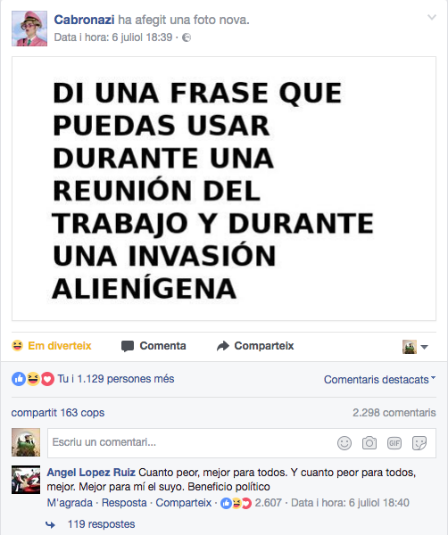

ANEXO I: 18 TÉCNICAS TRANSMEDIA PARA EL PLENO MUNICIPAL.
========================================================

Las siguientes propuestas de técnicas transmedia para plenos
municipales, son fruto de una tormenta de ideas en el “Taller de
Narrativas Transmedia para la no ficción” que organicé dentro del marco
de la Càtedra Govern Obert.

1.  Facebook Live creado por la asociación o el productor del producto
    transmedia en el canal del ayuntamiento / teasers del pleno.

2.  Sacar el pleno a la calle.

3.  Visibilizar acuerdos.

4.  Entrevistas donde lxs concejalxs comentan su opinión sobre asuntos
    del pleno.

5.  Preparar cortes con las intervenciones en los plenos defendiendo
    posturas y someterlas a la votación no vinculante de la ciudadanía
    (en plan juego).

6.  Durante la emisión en streaming (contenido lineal) para que la gente
    formule preguntas para el siguiente pleno.

7.  Crear una radio del minipleno anterior al pleno… recoger preguntas y
    que la gente las vote.

8.  Argumentos a favor vs. Argumentos en contra mediante entrevistas y
    después votación.

9.  Magazine en el que la gente interviene desde su casa a través de la
    SmartTV.

10. Análisis tuits en tiempo real y combinar la emisión del resultado de
    su análisis con la emisión en streaming del pleno.

11. Pedir/exigir a lxs concejalxs graben periscope, fotos en instagram.
    // Grabar como les enseñamos (alfabetización digital) a lxs
    concejalxs a aprender a hacer todo esto.

12. Etiquetar los contenidos del pleno para personalizar el consumo y
    crear tu propia narración.

13. Construir el personaje del alcalde a través de pequeñas piezas
    reales.

14. Usar los canales de whatsapp.

15. Casas de apuestas de los resultados de qué va a salir en los plenos.

16. Explicamos lo que están hablando más corte del concejal en el pleno.

17. Crear algo que en el tiempo dure (timeline) con el seguimiento de
    los temas que se abordan en los plenos.

18. Gamificar y aportar recompensas simbólicas a las audiencias.

Se puede consultar una pequeña crónica del taller en el blog del Àrea
Hackers Cívics, al cual se puede acceder a través del siguiente enlace:
&lt;https://goo.gl/co7pN1&gt;.

ANEXO II: *CONTROLADORAS DE REALIZACIÓN*.
=========================================

Para retransmitir vía *streaming* a través de los medios sociales, se
necesita hacer uso de un programa de realización televisiva. En el
mercado hay infinidad de modelos con diferentes características y
precios, pero en este proyecto me centraré en hablar de dos modelos
basados en software.

Por un lado, OBS es un programa de código abierto y de uso libre. En
teoría, según sus manuales es un software muy versátil y potente, pero
en realidad, en la práctica nos encontramos que se colapsa muy
fácilmente y tiene muchos errores de funcionamiento.

Por otro lado, Wirecast es un programa propietario, pero sirve una
versión de uso libre tan potente como la de pago con la objeción de
mostrar una marca de agua. La licencia es relativamente económica, por
lo que será más recomendable usar este programa.

ANEXO III: LENGUAJE RESPETUOSO.
===============================

El uso de los canales previstos de forma oficial por la producción es
completamente libre, sin embargo, hay que cumplir ciertas normas de
conducta. Entre ellas, el uso de un lenguaje respetuoso que promueva la
convivencia de una gran diversidad de usuarios.

Como propuesta de lenguaje respetuoso, se coge como propuesta las
empleadas en la primera versión de la plataforma analizo.info:

-   No introducir o difundir contenidos o propaganda de carácter
    racista, xenófobo, pornográfico, de apología del terrorismo o que
    atenten contra los derechos humanos.

-   No introducir o difundir en la red programas de datos (virus y
    software nocivo) susceptibles de provocar daños en los sistemas
    informáticos del proveedor de acceso, sus proveedores o terceros
    usuarios de la red Internet.

-   No difundir, transmitir o poner a disposición de terceros cualquier
    tipo de información, elemento o contenido que atente contra los
    derechos fundamentales y las libertades públicas reconocidos
    constitucionalmente y en los tratados internacionales.

-   No difundir, transmitir o poner a disposición de terceros cualquier
    tipo de información, elemento o contenido que constituya publicidad
    ilícita o desleal.

-   No transmitir publicidad no solicitada o autorizada, material
    publicitario, "correo basura", "cartas en cadena", "estructuras
    piramidales", o cualquier otra forma de solicitación.

-   No introducir o difundir cualquier información y contenidos falsos,
    ambiguos o inexactos de forma que induzca a error a los receptores
    de la información.

-   No difundir, transmitir o poner a disposición de terceros cualquier
    tipo de información, elemento o contenido que suponga una violación
    de los derechos de propiedad intelectual e industrial, patentes,
    marcas o copyright que correspondan a los titulares de la Página Web
    o a terceros.

-   No difundir, transmitir o poner a disposición de terceros cualquier
    tipo de información, elemento o contenido que suponga una violación
    del secreto de las comunicaciones y la legislación de datos de
    carácter personal.

ANEXO IV: REFERENTES GRÁFICOS.
==============================

Figura 1: Tuit Pleno Madrid 1. &lt;https://goo.gl/xEJApc&gt;
\[Consultado: 28 de junio de 2017\]

Figura 2: Publicación de Facebook Pleno Madrid 1.
&lt;https://goo.gl/jkcNU4&gt; \[Consultado: 28 de julio de 2017\]

Figura 3: Ludificación del contenido. &lt;https://goo.gl/DyJ5Ur&gt;
\[Consulta: 8 de julio de 2017\]

Figura 4: Efemérides. &lt;https://goo.gl/QqdoAV&gt; \[Consulta: 8 de
julio de 2017\]

Figura 5: Resumen de la semana parlamentaria. &lt;
https://goo.gl/XsZMLv&gt; \[Consulta: 8 de julio de 2017\]

Figura 6: Publicación *en directo*. &lt; https://goo.gl/2KGWdD&gt;
\[Consulta: 7 de julio de 2017\]

Figura 7: Facebook Notes "Agenda del congreso". &lt;
https://goo.gl/DFQR2p&gt; \[Consulta: 03 de junio de 2017\]

Figura 8: La política explicada por el medio digital VOX.
&lt;https://goo.gl/YTh5tZ&gt; \[Consultado: 28 de junio de 2017\]

Figura 9: Directo de la comisión de Participación Ciudadana,
Transparencia y Gobierno Abierto del Ayuntamiento de Madrid. &lt;
https://goo.gl/E5FRzY&gt; \[Consulta: 10 de Julio de 2017\]
